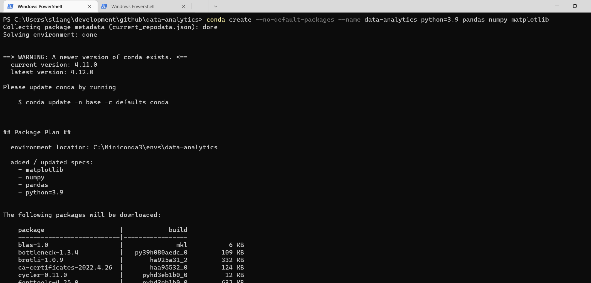
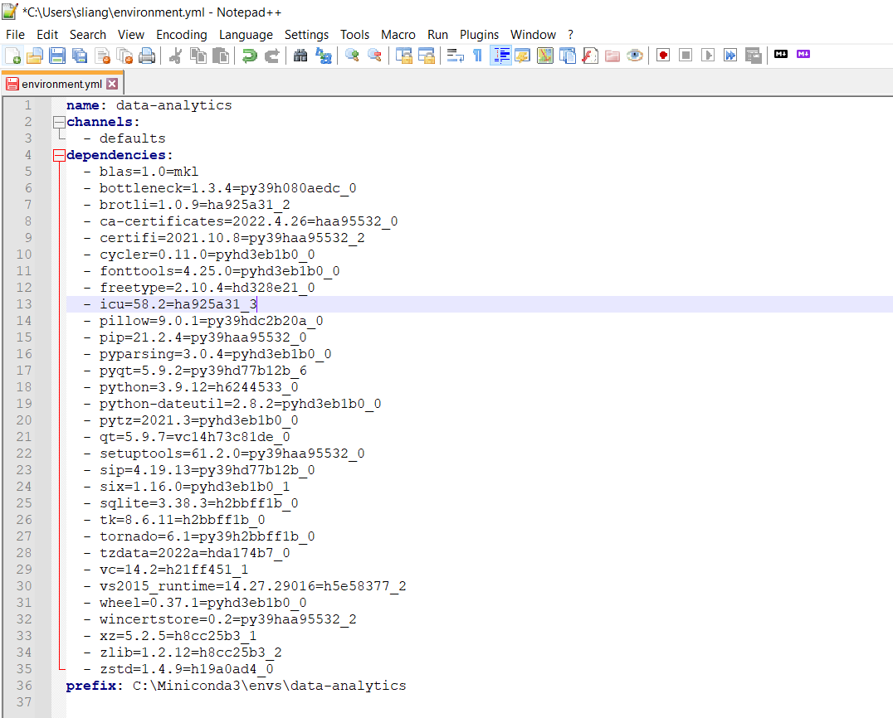
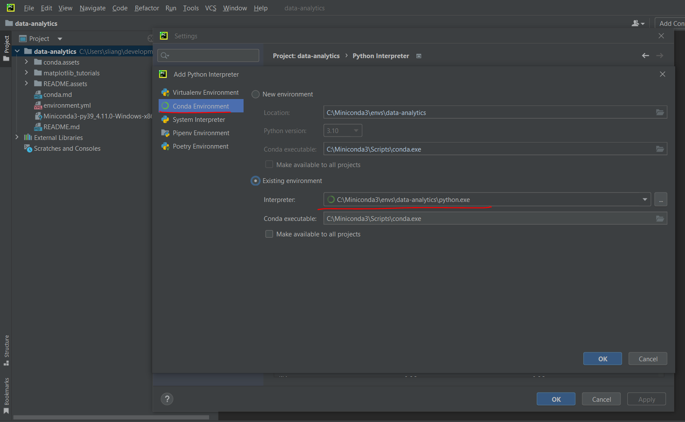
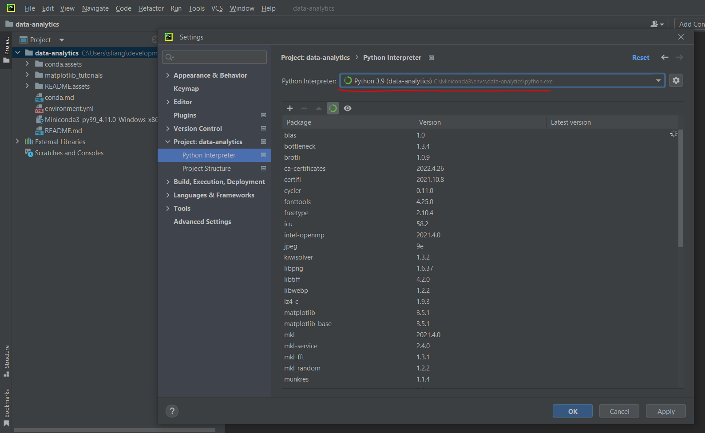
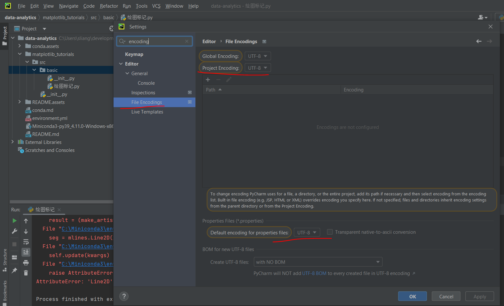
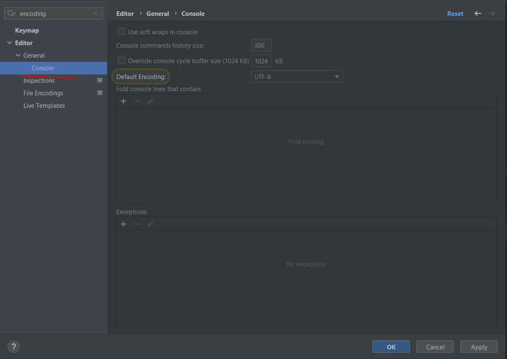

# Create conda environment

```
conda create --no-default-packages --name data-analytics python=3.9 pandas numpy matplotlib
```



or 

Go into `data-analytics` folder, then  use `environment.yml` to create an environment. 



```
conda create -f environment.yml
```

# Pycharm

Use `pycharm` to open this project, then select the conda environment you created as Python Interpreter.





Change encoding to 'UTF-8'  



