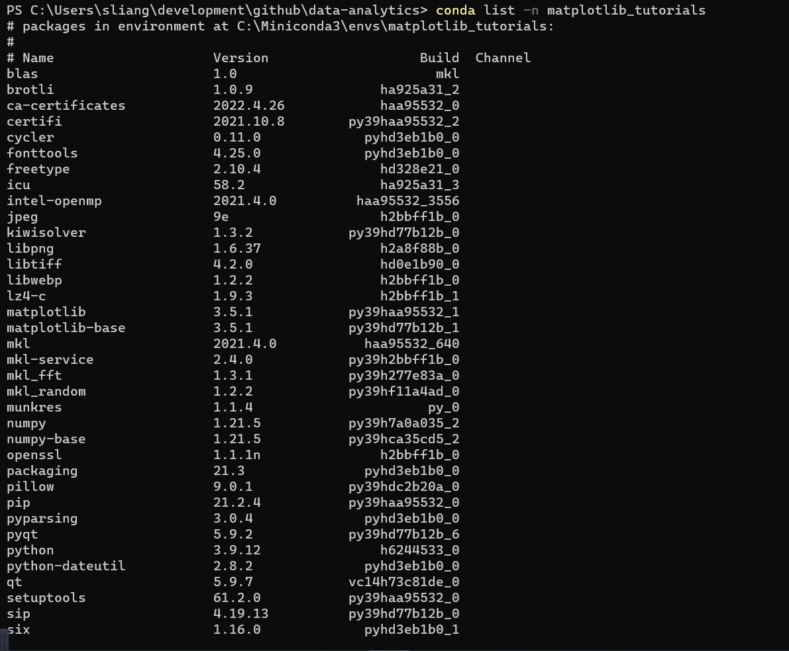
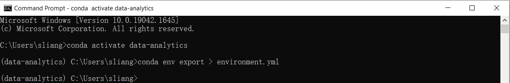

# Conda

Conda is an open source package management system and environment management system that runs on Windows, macOS, Linux and z/OS. Conda quickly installs, runs and updates packages and their dependencies. Conda easily creates, saves, loads and switches between environments on your local computer. It was created for Python programs, but it can package and distribute software for any language.

https://docs.conda.io/en/latest/


# Miniconda

Miniconda is a free minimal installer for conda. It is a small, bootstrap version of Anaconda that includes only conda, Python, the packages they depend on, and a small number of other useful packages, including pip, zlib and a few others. Use the `conda install` command to install 720+ additional conda packages from the Anaconda repository.

## Installation

https://docs.conda.io/en/latest/miniconda.html


https://repo.anaconda.com/miniconda/Miniconda3-py39_4.11.0-Windows-x86_64.exe

Add condabin to system `PATH`


# Conda Commands

```bash
PS C:\Users\sliang> conda --help
usage: conda-script.py [-h] [-V] command ...

conda is a tool for managing and deploying applications, environments and packages.

Options:

positional arguments:
  command
    clean        Remove unused packages and caches.
    compare      Compare packages between conda environments.
    config       Modify configuration values in .condarc. This is modeled after the git config command. Writes to the
                 user .condarc file (C:\Users\sliang\.condarc) by default.
    create       Create a new conda environment from a list of specified packages.
    help         Displays a list of available conda commands and their help strings.
    info         Display information about current conda install.
    init         Initialize conda for shell interaction. [Experimental]
    install      Installs a list of packages into a specified conda environment.
    list         List linked packages in a conda environment.
    package      Low-level conda package utility. (EXPERIMENTAL)
    remove       Remove a list of packages from a specified conda environment.
    uninstall    Alias for conda remove.
    run          Run an executable in a conda environment. [Experimental]
    search       Search for packages and display associated information. The input is a MatchSpec, a query language
                 for conda packages. See examples below.
    update       Updates conda packages to the latest compatible version.
    upgrade      Alias for conda update.

optional arguments:
  -h, --help     Show this help message and exit.
  -V, --version  Show the conda version number and exit.

conda commands available from other packages:
  content-trust
  env
```

## Environments Management

https://docs.conda.io/projects/conda/en/latest/user-guide/tasks/manage-environments.html

### List Environment

```bash
conda env list
```


### Create Environment

```bash
conda create --name matplot_tutorials python=3.9 matplotlib
```


### Activate Environment

```dos
conda activate matplotlib_tutorials
```


In the environments list that displays, your current environment is highlighted with an asterisk (*).

### List the dependency in Environment

```
conda list -n matplotlib_tutorials
```



## Upgrade Conda

```
conda update -n base -c defaults conda
```


## Sharing an environment

Activate it :

```
conda activate data-analytics
```

Export your active environment to a new file:

```
conda env export > environment.yml
```




Email or copy the exported `environment.yml` file to the other person.

