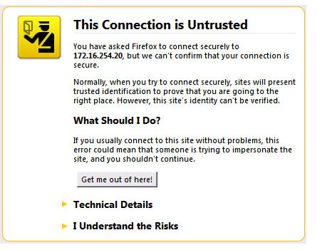
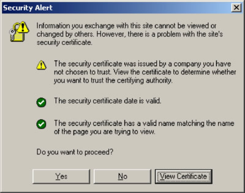
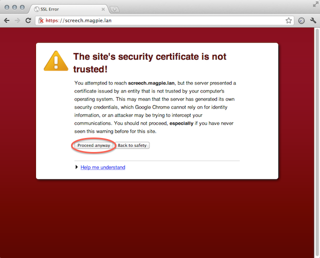

https://stackoverflow.com/questions/24507078/how-to-deal-with-certificates-using-selenium 

I am using Selenium to launch a browser. How can I deal with the webpages (URLs) that will ask the browser to accept a certificate or not?

In Firefox, I may have a website like that asks me to accept its certificate like this:



On the Internet Explorer browser, I may get something like this:



On Google Chrome:



I repeat my question: How can I automate the acceptance of a website's certificate when I launch a browser (Internet Explorer, Firefox and Google Chrome) with Selenium (Python programming language)?


For the Firefox, you need to set accept_untrusted_certs FirefoxProfile() option to True:

```python
from selenium import webdriver

profile = webdriver.FirefoxProfile()
profile.accept_untrusted_certs = True

driver = webdriver.Firefox(firefox_profile=profile)
driver.get('https://cacert.org/')

driver.close()
```

For Chrome, you need to add --ignore-certificate-errors ChromeOptions() argument:

```python
from selenium import webdriver

options = webdriver.ChromeOptions()
options.add_argument('ignore-certificate-errors')

driver = webdriver.Chrome(chrome_options=options)
driver.get('https://cacert.org/')

driver.close()
```

For the Internet Explorer, you need to set acceptSslCerts desired capability:

```python

from selenium import webdriver

capabilities = webdriver.DesiredCapabilities().INTERNETEXPLORER
capabilities['acceptSslCerts'] = True

driver = webdriver.Ie(capabilities=capabilities)
driver.get('https://cacert.org/')

driver.close()
```