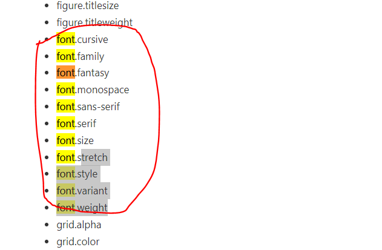

# About matplotlib

https://matplotlib.org/

Matplotlib is a comprehensive library for creating static, animated, and interactive visualizations in Python. Matplotlib makes easy things easy and hard things possible.

- Create [publication quality plots](https://ieeexplore.ieee.org/document/4160265/citations?tabFilter=papers).
- Make [interactive figures](https://mybinder.org/v2/gh/matplotlib/mpl-brochure-binder/main?labpath=MatplotlibExample.ipynb) that can zoom, pan, update.
- Customize [visual style](https://matplotlib.org/stable/gallery/style_sheets/style_sheets_reference.html) and [layout](https://matplotlib.org/stable/tutorials/provisional/mosaic.html).
- Export to [many file formats](https://matplotlib.org/stable/api/figure_api.html#matplotlib.figure.Figure.savefig) .
- Embed in [JupyterLab and Graphical User Interfaces](https://matplotlib.org/stable/gallery/#embedding-matplotlib-in-graphical-user-interfaces).
- Use a rich array of [third-party packages](https://matplotlib.org/mpl-third-party/) built on Matplotlib.

# Plot types

https://matplotlib.org/stable/plot_types/index

# Basic Knowledge

https://matplotlib.org/stable/tutorials/introductory/usage.html#

# 字体的家族（font-family)

matplotlib的字体的家族（font-family)一共有五类字体，他们分别是serif，sans-serif，cursive，fantasy，monospace，下面介绍下常用的三类。

**serif：**衬线字体， 宋体，Times News Romas属于这类字体

**sans-serif：**无衬线字体，黑体，Arial等都属于这类字体

**monospace：** 等宽字体，网络web端用的比较多

https://www.cnblogs.com/huahuayu/articles/8372933.html

# API Reference

https://matplotlib.org/stable/api/index.html

## pyplot.plot

https://matplotlib.org/stable/api/_as_gen/matplotlib.pyplot.plot.html

## pyplot.rcParams

https://matplotlib.org/stable/api/matplotlib_configuration_api.html#matplotlib.rcParams

设置字体

## font_manager.FontManager

https://matplotlib.org/stable/api/font_manager_api.html?matplotlib.font_manager.FontManager

## pyplot.grid

https://matplotlib.org/stable/api/_as_gen/matplotlib.pyplot.grid.html?highlight=grid#matplotlib.pyplot.grid