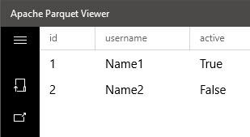

https://blog.contactsunny.com/data-science/how-to-generate-parquet-files-in-java

Parquet is an open source file format by Apache for the Hadoop infrastructure. Well, it started as a file format for Hadoop, but it has since become very popular and even cloud service providers such as AWS have started supporting the file format. This could only mean that Parquet should be doing something right. In this post, we’ll see what exactly is the Parquet file format, and then we’ll see a simple Java example to create or write Parquet files.

# Intro to Parquet File Format
We store data as rows in the traditional approach. But Parquet takes a different approach, where it flattens the data into columns before storing it. This allows for better data compression for storing, and also for better query performance. Also, because of this storage approach, the format can handle data sets with large number of columns.

Most big data projects use the Parquet file format because of all these features. Parquet files also reduce the amount of storage space required. In most cases, we use queries with certain columns. The beauty of the file format is that the data for a column is all adjacent, so the queries run faster.

Because of the optimization and the popularity of the file format, even Amazon provides built-in features to transform incoming streams of data into Parquet files before saving into [S3](https://blog.contactsunny.com/?s=s3) ([which acts as a data lake](https://blog.contactsunny.com/data-science/how-to-build-a-simple-data-lake-using-amazon-kinesis-data-firehose-and-amazon-s3)). I have used this extensively with [Amazon’s’Athena](https://blog.contactsunny.com/?s=athena) and some Apache services. For more information about the Parquet file system, you can refer the official documentation.

You are hereHome > Data Science >
How To Generate Parquet Files In Java
Data Science by Sunny Srinidhi - April 7, 20207
parquet logo
Parquet is an open source file format by Apache for the Hadoop infrastructure. Well, it started as a file format for Hadoop, but it has since become very popular and even cloud service providers such as AWS have started supporting the file format. This could only mean that Parquet should be doing something right. In this post, we’ll see what exactly is the Parquet file format, and then we’ll see a simple Java example to create or write Parquet files.

Intro to Parquet File Format
We store data as rows in the traditional approach. But Parquet takes a different approach, where it flattens the data into columns before storing it. This allows for better data compression for storing, and also for better query performance. Also, because of this storage approach, the format can handle data sets with large number of columns.


Most big data projects use the Parquet file format because of all these features. Parquet files also reduce the amount of storage space required. In most cases, we use queries with certain columns. The beauty of the file format is that the data for a column is all adjacent, so the queries run faster.

Because of the optimization and the popularity of the file format, even Amazon provides built-in features to transform incoming streams of data into Parquet files before saving into S3 (which acts as a data lake). I have used this extensively with Amazon’s’Athena and some Apache services. For more information about the Parquet file system, you can refer the official documentation.

# The Dependencies
Before we start writing the code, we need to take care of the dependencies. Because this is a [Spring Boot](https://blog.contactsunny.com/?s=spring+boot) Maven project, we’ll list all our dependencies in the pom.xml file:

```xml
<dependencies>
    <dependency>
        <groupId>org.springframework.boot</groupId>
        <artifactId>spring-boot-starter</artifactId>
    </dependency>
    <dependency>
        <groupId>org.apache.parquet</groupId>
        <artifactId>parquet-hadoop</artifactId>
        <version>1.8.1</version>
    </dependency>
    <dependency>
        <groupId>org.apache.hadoop</groupId>
        <artifactId>hadoop-core</artifactId>
        <version>1.2.1</version>
    </dependency>
</dependencies>
```
As you can see, we are adding the Spring Boot starter package and a couple of other Apache dependencies. For this example, this is all we need.


# The Properties
As always, we have an application.properties file where we specify all the properties. For this example, we only need two properties: one specifying the path of the schema file, and the other specifying the path of the output directory. We’ll learn more about the schema a bit later. So, the properties file looks like this:
```properties
schema.filePath=
output.directoryPath=
```
And because this is a Spring Boot application, we’ll be using the @Value annotation to read these values in the code:

```java
@Value("${schema.filePath}")
private String schemaFilePath;

@Value("${output.directoryPath}")
private String outputDirectoryPath;
```
# Schema of the Parquet File
We need to specify the schema of the data we’re going to write in the Parquet file. This is because when a Parquet binary file is created, the data type of each column is retained as well. Based on the schema we provide in a schema file, the code will format the data accordingly before writing it to the Parquet file.

In this example, I’m keeping it simple, as you can see from the schema file below:
```
message m {
required INT64 id;
required binary username;
required boolean active;
}
```
Let me explain what this is. The first parameter is of type INT64, which is an integer, and it is called id. The second field is of type binary, which is nothing but string. We’re calling this the username field. Third is a boolean field called active. This is a pretty simple example. But unfortunately, if your data has a hundred columns, you’ll have to declare all of them here.

The required keyword before the field declaration is used for validation, to make sure that a value is specified for that field. This is optional and you can remove it for fields which are not mandatory.

# The ParquetWriter
Disclaimer time, I did not write these two classes that I’m discussing in this section. A few months back when I was researching this, I found these two classes on StackOverFlow. I don’t know who wrote this, but I’ve just been using these two classes everywhere. But yes, I have renamed the classes to suit the project.

First, the CustomParquetWriter class. This extends the ParquetWriter class that Apache provides. The code for this class is as follows:

```java
public class CustomParquetWriter extends ParquetWriter<List<String>> {

    public CustomParquetWriter(
            Path file,
            MessageType schema,
            boolean enableDictionary,
            CompressionCodecName codecName
    ) throws IOException {
        super(file, new CustomWriteSupport(schema), codecName, DEFAULT_BLOCK_SIZE, DEFAULT_PAGE_SIZE, enableDictionary, false);
    }
}
```
There’s not much to talk about here. The next is `CustomWriteSupport`, which you can see as the second parameter to the `super()` constructor in the snippet above. This is where a lot of things are happening. You can check the [repo](https://github.com/contactsunny/Parquet_File_Writer_POC) for the complete class and see what it does.

Basically, the class checks the schema to determine the data type of each field. After this, using an instance of the `RecordConsumer` class, the data is written to the file. I’ll not talk much about these two classes, because a) I didn’t write them, and b) the code is simple enough for anybody to understand.

# Preparing the Data for the Parquet file
Let’s get some data ready to write to the Parquet files. A list of strings represents one data set for the Parquet file. Each item in this list will be the value of the correcting field in the schema file. For example, let’s assume we have a list like the following:

```
{"1", "Name", "true"}
```
Looking at the scheme file, we can tell that the first value in the array is the ID, the second value is the name, and the third value is a boolean flag for the active field.

So, in our code, we’ll have a list of list of String to represent multiple lines. Yes, you read that right, it’s a list of list of strings:

List<List<String>> columns = getDataForFile();
Let’s look at the function to see how we’re generating the data:

```java
private List<List<String>> getDataForFile() {
List<List<String>> data = new ArrayList<>();

    List<String> parquetFileItem1 = new ArrayList<>();
    parquetFileItem1.add("1");
    parquetFileItem1.add("Name1");
    parquetFileItem1.add("true");

    List<String> parquetFileItem2 = new ArrayList<>();
    parquetFileItem2.add("2");
    parquetFileItem2.add("Name2");
    parquetFileItem2.add("false");

    data.add(parquetFileItem1);
    data.add(parquetFileItem2);

    return data;
}
```
That’s pretty easy, right? Let’s move on then.

# Getting the Schema file
As we already discussed, we have a schema file. We need to get that schema into the code, specifically, as an instance of the MessageType class. Let’s see how to do that:

```java
MessageType schema = getSchemaForParquetFile();

...

private MessageType getSchemaForParquetFile() throws IOException {
    File resource = new File(schemaFilePath);
    String rawSchema = new String(Files.readAllBytes(resource.toPath()));
    return MessageTypeParser.parseMessageType(rawSchema);
}

```
As you can see, we’re just reading the file as string, and then parsing that string using the parseMessageType() method in the MessageTypeParser class provided by the Apache library.

# Getting the Parque Writer
This is almost the last step in the process. We just have to get an instance of the CustomParquetWriter class that we discussed earlier. Here, we also provide the path of the output file to which the writer will write. The code for this is also pretty simple:

```java
CustomParquetWriter writer = getParquetWriter(schema);

...

private CustomParquetWriter getParquetWriter(MessageType schema) throws IOException {
    String outputFilePath = outputDirectoryPath+ "/" + System.currentTimeMillis() + ".parquet";
    File outputParquetFile = new File(outputFilePath);
    Path path = new Path(outputParquetFile.toURI().toString());
    return new CustomParquetWriter(path, schema, false, CompressionCodecName.SNAPPY);
}
```
# Writing data to the Parquet File
This is the last step, we just have to write the data to the file. We’ll loop the list of list that we created and we’ll write each list to the file using the writer we created in the previous step:
```java
for (List<String> column : columns) {
    writer.write(column);
}
logger.info("Finished writing Parquet file.");
writer.close();
```
That’s pretty much it. You can go to the output directory and check the file created. For example, this is what I got after running this project:



If you want to start directly with the working example, you can find the Spring Boot project in my [Github repo](https://github.com/contactsunny/Parquet_File_Writer_POC). And if you have any doubts or queries, feel free to ask me in the comments.

And if you like what you see here, or on my Medium blog, and would like to see more of such helpful technical posts in the future, consider supporting me on Patreon and Github.

