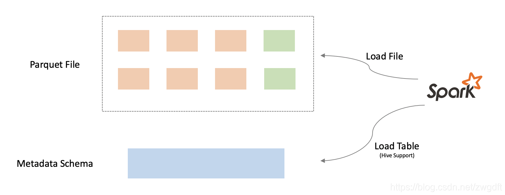
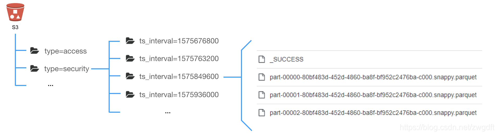
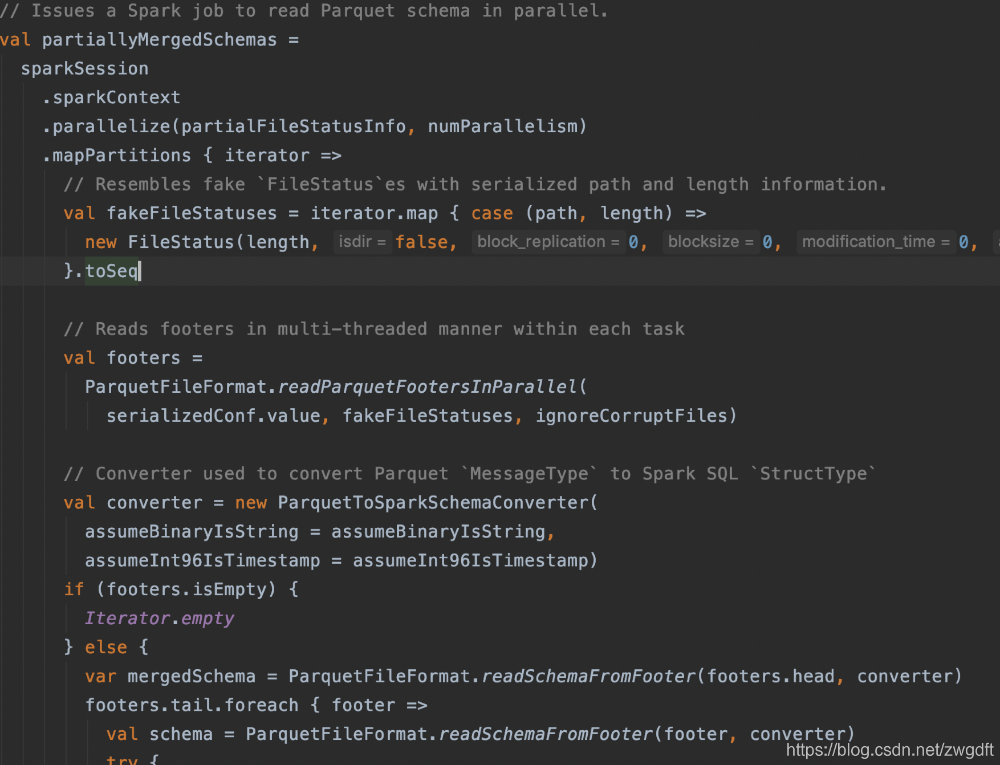
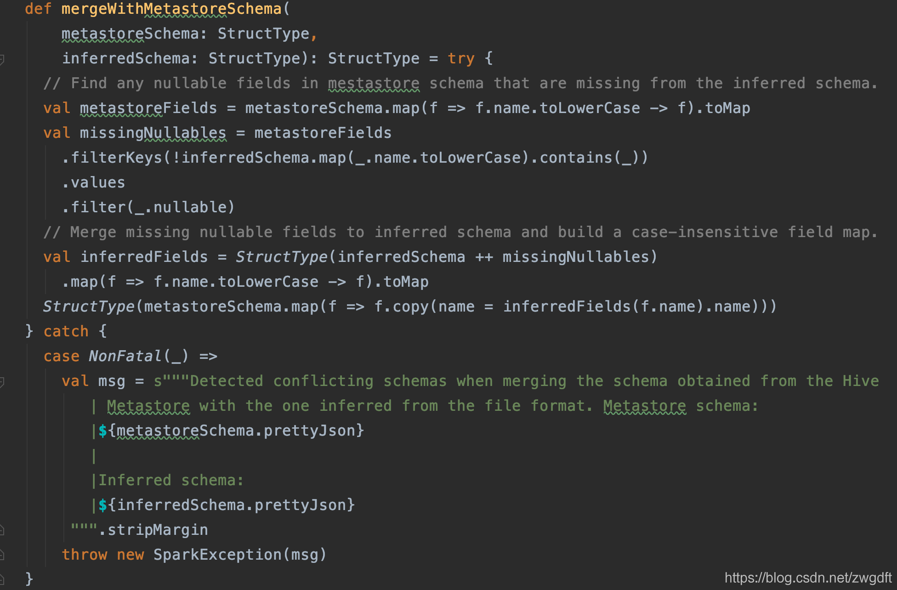

Parquet是一种存储格式，其本身与任何语言、平台都没有关系，也不需要与任何一种数据处理框架绑定。但是一个开源技术的发展，必然需要有合适的生态圈助力才行，Spark便是Parquet的核心助力之一。作为内存型并行计算引擎，Spark被广泛应用在流处理、离线处理等场景，其从1.0.0便开始支持Parquet，方便我们操作数据。

在Spark中操作Parquet文件有两种方式，一种是直接加载文件，另一种是透过Hive表来读取数据。我们姑且称之为文件加载、表加载。这两种方式在API层面都非常简洁，它隐藏了底层推导Schema、并行加载数据等细节。
```
# By File
df = spark.read.parquet("s3://mydata/type=security")
# By Table
df = spark.read.table("data_mine.security_log")
```
在实际使用中，我们经常会遇到Schema兼容的问题，其根源是Schema不一致，主要有以下两种情况：

- 存放在HDFS/S3上面的Parquet文件具有不同的Schema
- Hive Metastore Schema与Parquet文件自带的Schema不一致

不管是需求变化、产品迭代还是其他原因，总是会出现Schema变化的情况，导致不同Parquet文件的Schema不同。比如，新增了一个字段。如果是以表加载方式操作数据，当Schema变化时，需要更新Metastore Schema，此时又会导致Metastore中的Schema跟部分Parquet文件的Schema不一致。要确保在这些问题下，我们仍然能通过Spark正确的加载文件数据，就需要搞清楚里面的一些实现细节。



本文将从文件加载、表加载两个方面来探讨Spark是如何做Schema推导和兼容的。文中所述的细节均基于Spark 2.4.0。


# 文件加载
在加载Parquet文件时，Spark会先建立InMemoryFileIndex、推导Schema。建立InMemoryFileIndex，是指枚举指定路径下的文件，获取相应的Partition与文件路径信息。比如，下图中 s3://mydata/type=security 路径下有4个ts_interval的Partition，每个Partition下有3个Parquet。这些信息会缓存在Spark Driver中，用于后续的Pushdown Filter、访问文件等。
 

有了InMemoryFileIndex，便可以访问Parquet文件的Footer信息来获取Schema了。默认情况下，Spark会选择其中一个文件来读取Schema。这个做法在多个Parquet文件具有不同Schema时就会有问题。因此，Spark提供了参数spark.sql.parquet.mergeSchema，当其被设置为true时，便会读取所有文件的Schema进行合并。需要注意的是，如果两个文件中存在同一个名称的字段，但是二者的数据类型不一样，是无法进行Merge的，会直接报错。

显然，这是通过牺牲一定的性能来换取Schema的准确性。为了将性能的损耗降到最低，Spark采用了并行加载的方式来读取Schema，然后再进行合并，具体可以查看源代码中的mergeSchemasInParallel函数。
  
鉴于mergeSchema的性能问题，我们应该尽量避免两点：

- 避免在大范围的数据上使用该参数，比如只在一天的数据上应用
- 避免在全局周期内使用该参数，比如只在某个过渡期间开启该参数 

还有一种方式是在读取文件时指定Schema。在这种情况下，Spark不再推导Schema。Schema的兼容参照下面规则：

- 如果指定的Schema中有字段A，某个Parquet文件中没有，A会被赋值为null
- 如果指定的Schema中没有字段A，而在某个Parquet文件中有，字段A会被忽略掉
- 如果字段A的类型在指定的Schema和Parquet文件中的不一致，则会报错

```
schema = StructType([StructField("name", StringType()), StructField("age", LongType()), StructField("gender", StringType())])
df = spark.read.schema(schema).parquet("file:///Downloads/user_specified_schema_test")
```

# 表加载
Hive系统由三部分组成：存储在HDFS/S3的数据、Metastore、HiveQL。在Spark中开启Hive支持后，主要是利用其前两部分，即透过Metastore来访问数据，而具体的执行引擎是采用Spark SQL自己的。HiveExternalCatalog中提供了一系列操作Hive Metastore的方法。

通过表来加载Parquet文件数据时，Spark会从Metastore中拿到Partition、文件路径等信息，因此不需要再建立InMemoryFileIndex了。Spark先推导文件的Schema，然后跟Metastore中的Schema进行合并。推导文件Schema的方法在上面已做了详细阐述，这里主要探讨下两种Schema合并的规则：

- 对于相同的字段（不区分大小写），采用Parquet文件中的字段名加上Metastore中的数据类型，如果类型不能被转换则会报错
- 如果Metastore中有字段A，Parquet文件中有A和B，则只有A
- 如果Metastore中有字段A和B， Parquet文件中只有B，那么有A和B，但是A必须是nullable，A会被赋值为null

- 上述规则可以参考阅读源码中的mergeWithMetastoreSchema函数，如果觉得比较晦涩，可以参考阅读其测试用例。

————————————————
版权声明：本文为CSDN博主「Mr-Bruce」的原创文章，遵循CC 4.0 BY-SA版权协议，转载请附上原文出处链接及本声明。
原文链接：https://blog.csdn.net/zwgdft/article/details/104670086

