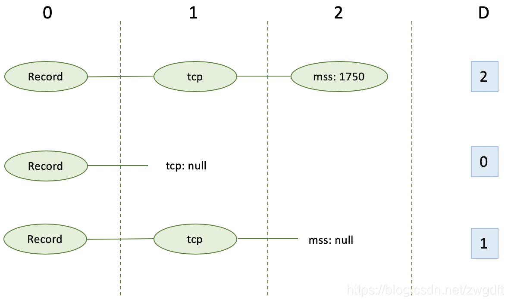
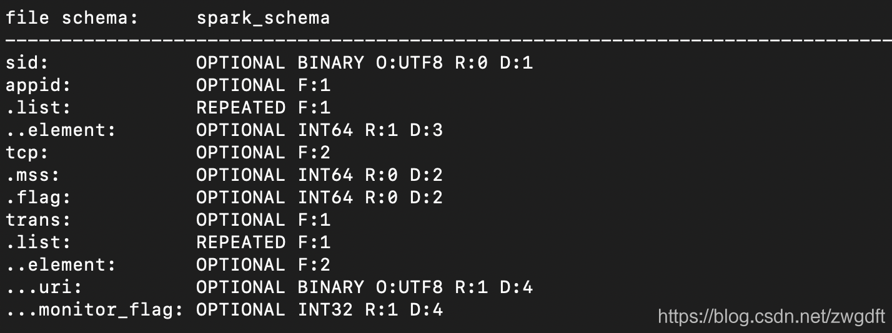

在大数据系统中，我们总是不可避免的会遇到嵌套结构的数据。这是因为，在很多场景下，嵌套数据结构能更好的表达数据内容与层级关系，因此很多数据源会采用这样的结构来输出数据。然而，相比关系型的结构化数据，这样的数据并不利于高效查询，因此在很多场景下，我们还会通过ETL将其变为扁平结构的数据来存储。

2010年，Google发表了论文Dremel: Interactive Analysis of Web-Scale Datasets，阐述了一种针对嵌套数据的交互式查询系统，为业界提供了思路。正如官方文档所述，Parquet在最初设计时，便借鉴了Dremel的数据模型思想，支持嵌套结构的存储。当然，Parquet只是一种列式存储格式，要完成类似Dremel的查询功能，还需要计算引擎的配合。

```
Parquet is built from the ground up with complex nested data structures in mind, 
and uses the record shredding and assembly algorithm described in the Dremel paper. 
We believe this approach is superior to simple flattening of nested name spaces.
```
本文主要探讨Parquet是如何支持嵌套结构存储的。搞清楚这些，能帮助我们更好的设计数据存储方式、选择合适的查询引擎。本文将采用下面的3条数据来进行阐述，后面用“示例”来代表。另外，文中所述是基于Spark 2.4.0、Parquet 1.10.0的。

```
Record 1:
{
    "sid":"8509_1576752657",
    "appid":[81, 205, 67],
    "tcp": {
        "mss": 1750,
        "flag": 344
    },
    "trans":[
        {
            "uri":"/icon.jpg",
            "monitor_flag":1
        },
        {
            "uri":"/myyhp_2.2-4.js"
        }
    ]
}

Record 2:
{
    "sid":"8510_1576752667",
    "appid":[58, 98]
}

Record 3:
{
    "sid":"8511_1576754667",
    "appid":[198],
    "tcp": {
        "flag": 256
    }
}

```

# 数据模型
我们先来看看嵌套结构的数据具有哪些特性，从而搞清楚其存储要解决的问题是什么。

- 数据具有层级关系，比如示例中的tcp下面有mss和flag
- 允许部分字段为空，即没有定义，比如示例中的trans在第2、3条数据中都没有
- 有些字段的值有多个，即是一个数组，比如示例中的appid
在Parquet的世界里，数据是以列式存储的，每条数据最终都要转化成一组列来存储。那么，该用什么模型来表达一个嵌套结构呢？

参考Dremel的方式，针对示例中的数据，可以使用下面的模型来表达。对于一个数据结构，其根为Record，称为message，其内部每个字段包含三部分：字段类型、数据类型、字段名称。通过数据类型group来表达层级关系；通过将字段类型分为三种，来表达空或数组的概念。
```
required：exactly one occurrence
optional: 0 or 1 occurrence
repeated: 0 or more occurrence
```

```
message Record {
	required string sid, 
	repeated long appid,
	optional group tcp {
		optional long mss,
		optional long flag
	},
	repeated group trans {
		optional string uri,
		optional int monitor_flag
	}
}
```
我们将上面的数据模型转化成树型关系图，其所要表达的数据列便会呈现出来。


到这里，我们可以将示例中的数据转换成下表所示的形式，来实现列式存储。然而，新的问题又出现了，我们无法将其恢复到原来的数据行的结构形式。以appid为例，你不知道这些值里面哪些是第一行的值，哪些是第二行的，等等。因此，单纯依靠一个值来表达是不够了。Parquet采用了Dremel中(R, D, V)模型，V表示数据值，D和R将在下面分别介绍。


# Definition Level
D，即Definition Level，用于表达某个列是否为空、在哪里为空，其值为当前列在第几层上有值。对于required的字段，没有D值。

以示例的trans.monitor_flag为例。Root为第0层级，trans为第1层级，monitor_flag为第2层级。在第1条数据中，trans有两个值，第1个值里面的monitor_flag有值，因此D=2；第2个里面没有monitor_flag，因此D=1。在第2条数据中，没有trans，因此D=0。第3条数据，与第2条数据情况一致。

另一个列tcp.mss的情况如下，读者可以自行推导。


# Repetition Level
R，即Repetition Level，用于表达一个列有重复，即有多个值的情况，其值为重复是在第几层上发生。

以示例的appid为例。Root为第0层级，appid为第1层级。对于每条新的数据，第1个appid的值对应的R一定是0；而对于每条数据里面的多个值，则是用appid所在的层来表示，即R=1。比如，第1条数据有3个appid值，其第1个的R=0，后面两个的R=1。


# 整体总结
有了上面的阐述，我们可以对示例的数据进行整理，得到每个列及其相应的(R, D, V)的值。这个数据模型，既满足了列式存储，又可以有效的恢复原有的数据行。


但是，如果我们将示例数据通过Spark写入到Parquet文件，会发现Parquet文件的Schema信息与我们上面的阐述略有差别，主要表现在：

- 对于sid列，我们期望的是required，而文件Schema里面是optional
- 对于appid与trans，文件Schema在对数组的表达上增加了两层，即.list.element

通过分析，这两个问题都跟Spark有关。第一个问题，是因为在Spark中定义schema时，将sid字段的nullable设置为true了，导致Spark认为其为optional。对于required类型字段，应该将其置为false。

```
StructField("sid", StringType(), False)
```

第二个问题，跟Spark的ParquetWriteSupport有关，其在表述Array数据类型时增加了list和element两层，采用了三层关系的方式。根据这个变化，我们对上述的树形图和列值进行了修正，主要变化的是appid和trans下面的D值，对R和V值没有影响。


# 结尾
本文从嵌套结构的特性入手，逐步探讨了Parquet的嵌套数据模型。正如文章开头所言，很多场景下我们最关注的是查询性能，而Parquet只是提供了一种存储方式，具体的查询还要依赖生态圈内的计算引擎，比如Spark、Presto等。其性能通常与相应的计算引擎中的Parquet Reader有关，因为他们决定了能否有效的进行嵌套字段的Column Pruning和Predicate Pushdown Filter。

我们曾经在AWS Athena下做过嵌套数据与扁平数据的查询性能对比，前者比后者差了60多倍以上，主要表现在查询时间和加载的数据量上。AWS Athena底层跑的是Presto，因为是托管服务，我们尚且不知道是Presto的哪个版本，但至少说明这个Presto没有很好的支持嵌套数据查询。Spark在2.4.0之前对嵌套数据查询的支持也很弱。关于这些，我将在后面另起博文来分析Spark和Presto中对嵌套数据查询的支持情况。
————————————————
版权声明：本文为CSDN博主「Mr-Bruce」的原创文章，遵循CC 4.0 BY-SA版权协议，转载请附上原文出处链接及本声明。
原文链接：https://blog.csdn.net/zwgdft/article/details/105417979