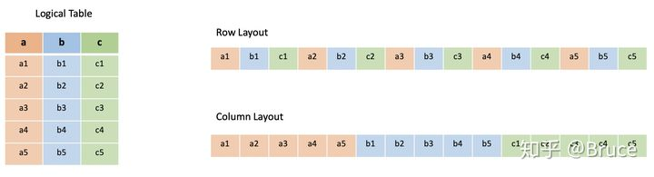
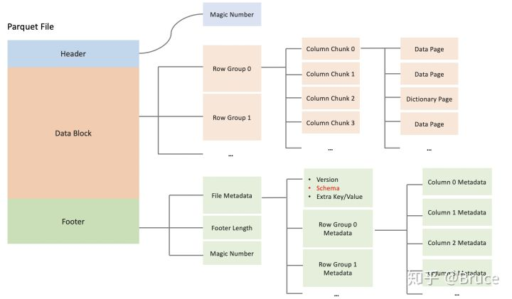
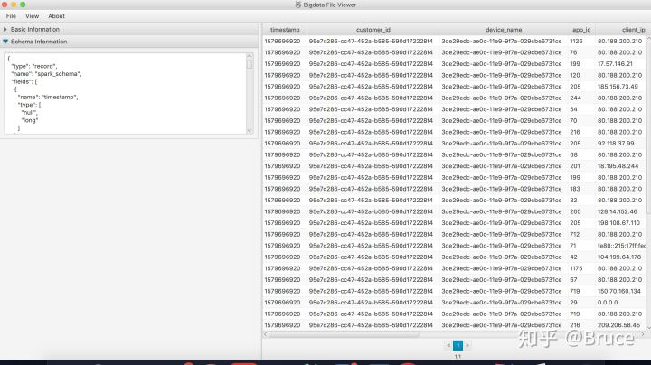

数据的接入、处理、存储与查询，是大数据系统不可或缺的四个环节。随着数据量的增加，大家开始寻找一种高效的数据格式，来解决存储与查询环节的痛点。

- 高效的压缩编码，用于降低存储成本  
- 高效的读取能力，用于支撑快速查询    

Parquet便是在这样的背景下诞生，与TEXT、JSON、CSV等文件格式相比，它有三个核心特征，为解决上述的痛点问题提供了基础。

- 列式存储
- 自带Schema
- 具备Predicate Filter特性 

在行式存储中，一行的多列是连续地写在一起的，而在列式存储中，数据按列分开存储。由于同一列的数据类型是一样的，可以使用更高效的压缩编码进一步节约存储空间。


对于大多数数据存储服务，如MySQL、MongoDB、Elasticsearch等，为了提高查询性能，都会在数据写入时建立相应的索引。而存放在HDFS、AWS S3上的大数据是直接以文件形式存储的，那么如何实现快速查询呢？目前主要有三种手段，核心目的是尽可能只加载有符合数据的文件，而这些手段都能基于Parquet实现。

- Partition Pruning。类似于将文件分文件夹存放的思路，根据某些字段将数据进行分区，在查询时指定相应的分区条件。
- Column Projection。在查询中指定需要返回的字段，跳过不必要的字段，减少需要加载的数据量。
- Predicate Filter。先判断一个文件中是否存在符合条件的数据，有则加载相应的数据，否则跳过。

本文主要介绍Parquet的文件结构、Predicate Filter特性以及常用的一些工具。与Parquet相似且有着广泛应用的还有ORC，我们将在后面介绍二者的区别。本文所述主要基于parquet-mr 1.8.2。

# Parquet文件结构
一个Parquet文件的内容由Header、Data Block和Footer三部分组成。在文件的首尾各有一个内容为PAR1的Magic Number，用于标识这个文件为Parquet文件。Header部分就是开头的Magic Number。

Data Block是具体存放数据的区域，由多个Row Group组成，每个Row Group包含了一批数据。比如，假设一个文件有1000行数据，按照相应大小切分成了两个Row Group，每个拥有500行数据。每个Row Group中，数据按列汇集存放，每列的所有数据组合成一个Column Chunk。因此一个Row Group由多个Column Chunk组成，Column Chunk的个数等于列数。每个Column Chunk中，数据按照Page为最小单元来存储，根据内容分为Data Page和Dictionary Page。这样逐层设计的目的在于：

- 多个Row Group可以实现数据的并行加
- 不同Column Chunk用来实现列存储
- 进一步分割成Page，可以实现更细粒度的数据访问

Footer部分由File Metadata、Footer Length和Magic Number三部分组成。Footer Length是一个4字节的数据，用于标识Footer部分的大小，帮助找到Footer的起始指针位置。Magic Number同样是PAR1。File Metada包含了非常重要的信息，包括Schema和每个Row Group的Metadata。每个Row Group的Metadata又由各个Column的Metadata组成，每个Column Metadata包含了其Encoding、Offset、Statistic信息等等。


# Predicate Pushdown Filter特性
所谓Predicate Pushdown Filter，是指在不影响结果的情况下，将过滤条件提前执行，过滤掉不满足条件的文件，降低需要传输的数据集，从而提升性能。比如，在S3上面有1000个文件（100GB），现在要执行下面的SQL查询，有两种选择：

- 将所有文件内容都加载进来（1000个文件），再对内容执行过滤条件，得到结果
- 只加载有符合条件(age >= 22)的数据的文件（100个文件），得到结果

```sql
SELECT name, school FROM student WHERE age >= 22
```
第二个选择就是Predicate Pushdown Filter的方式。那么在Parquet中如何做到这点呢？在读取Parquet文件时，会先根据Footer Length找到Footer起始位置，读取Parquet中的Metadata，通过Metadata中的信息可以帮助我们进行相应的条件过滤。目前有两种实现，分别针对不同的数据类型。

- 整型数据
Column Metada中，有该Column Chunk中数据的Range信息: Max和Min。将过滤条件与Range信息进行对比，就可以知道是否需要加载该文件的数据。

```
File 0
	Row Group 0, Column Statistics -> (Min -> 20, Max -> 30)
	Row Group 1, Column Statistics -> (Min -> 10, Max -> 20)
File 1
	Row Group 0, Column Statistics -> (Min -> 6, Max -> 21)
	Row Group 1, Column Statistics -> (Min -> 25, Max -> 45)
```
	
通过对比过滤条件age >= 22，只需要加载File 0的Row Group 0和File 1的Row Group 1中的数据。

- 字符数据

先说说什么是字典编码。假设有个字段name，在10条数据中的值分别为：
```
name:
	bruce, cake, bruce, kevin, bruce, kevin, cake, leo, cake, bruce
```
我们可以对其编码，将其变为：
```
name:
	0, 1, 0, 2, 0, 2, 1, 3, 1, 0
dictionary:
	0 -> bruce, 1 -> cake, 2 -> kevin, 3 -> leo
```
这种方式在很多开源软件中都有使用，比如Elasticsearch，有两个优点：

- 可以节省存储空间
- 可以根据dictionary中的内容，过滤掉不符合条件的数据

在Parquet中，我们可以根据字符编码的特性来做相应的过滤。通过Column Metada中的信息，读取相应的Dictionary Page进行对比，从而过滤掉不符合条件的数据。

```
查询语句： SELECT name, school FROM student WHERE name = "leo"

File 0
	Row Group 0, Column 0 -> 0: bruce, 1:cake
	Row Group 1, Column 0 -> 0: bruce, 2:kevin
File 1
	Row Group 0, Column 0 -> 0: bruce, 1:cake, 2: kevin
	Row Group 1, Column 0 -> 0: bruce, 1:cake, 3: leo
通过对比过滤条件name = "leo"，只需要加载File 1的Row Group 1中的数据。
```

# 常见的Parquet工具
与JSON、CSV等文件相比，Parquet是无法人类可读的，需要通过一些工具来窥探其内容，这里列举一些常用的工具，供选择。

- parquet-mr提供的工具parquet-tools
由官方提供，下载源码编译jar包  
采用命令行形式，通过参数来指定相关功能  
```
示例：
java -jar ./parquet-tools-1.8.2.jar meta part-00003-c04d37ba-3de5-4f7b-addc-b6f4bc5a7ab1-c000.snappy.parquet
```

- 开源的工具bigdata-file-viewer

通过[GitHub](https://github.com/Eugene-Mark/bigdata-file-viewer)下载jar包  
有UI可以查看数据，通过命令行启动UI  
java -jar ./BigdataFileViewer-1.2-SNAPSHOT-jar-with-dependencies.jar  

————————————————
版权声明：本文为CSDN博主「Mr-Bruce」的原创文章，遵循CC 4.0 BY-SA版权协议，转载请附上原文出处链接及本声明。
原文链接：https://blog.csdn.net/zwgdft/article/details/104582229