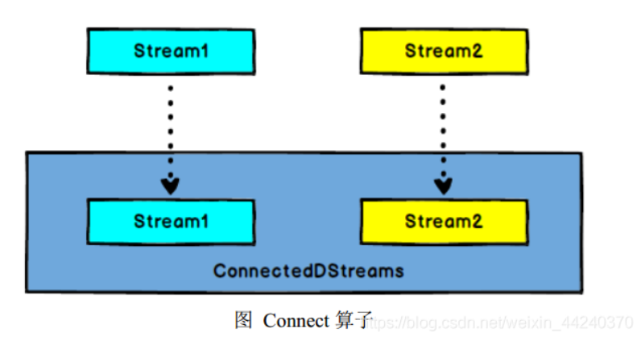
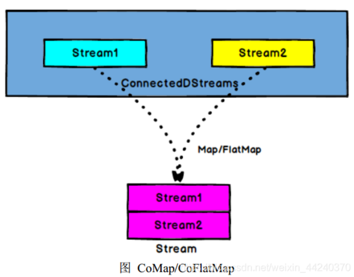
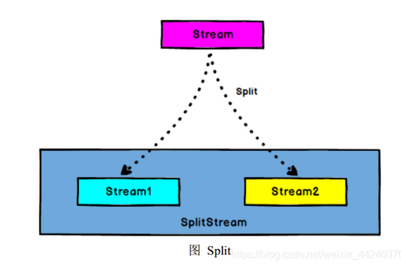
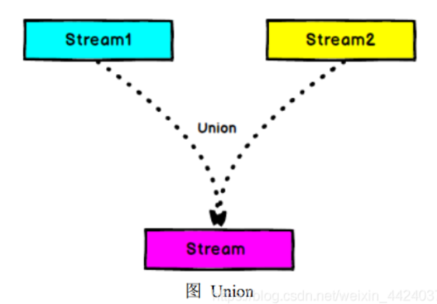

# 四、Flink DataStream API

## 4.1、Flink运行模型

以上为Flink运行模型，Flink程序主要由Source、Transformation、Sink。Source主要负责数据读取，Transformation主要对负责属于的转换操作，Sink负责最终数据的输出。


## 4.2、Flink程序架构

每个Flink程序都包含以下若干流程：

- 获得一个执行环境(Execution Environment) 
- 加载/创建初始数据(Source) 
- 指定转换这些数据(Transformation)
- 指定放置计算结果的位置(Sink)
- 触发程序执行

## 4.3、Environment

执行环境StreamExecutionEnvironment是所有Flink程序的基础。

创建执行环境的方式有三种，分别是：

```
StreamExecutionEnvironment.getExecutionEnvironment
StreamExecutionEnvironment.createLocalEnvironment
StreamExecutionEnvironment.createRemoteEnvironment
```

### 4.3.1、StreamExecutionEnvironment.getExecutionEnvironment

创建一个执行环境表示当前执行程序的上下文，如果程序时独立调用的此方法返回本地执行环境；如果从命令行客户端调用程序以提交到集群此方法返回此集群的执行环境，就是说getExecutionEnvironment根据查询运行方式决定返回什么样的运行环境是最常用的一种创建执行环境的方式。

### 4.3.2、StreamExecutionEnvironment.createLocalEnvironment

返回本地执行环境，需要在调用时候指定默认的并行度。

### 4.3.3、StreamExecutionEnvironment.createRemoteEnvironment

返回集群执行环境，将jar提交到远程服务器，需要在调用时指定JobManager的IP和端口号并指定要在集群中运行的jar包。

## 4.4、Source

### 4.4.1、基于File的数据源

1、readTextFile(path)
一列一列的读取遵循TextInputFormat规范的文本文件，并将结果作为String返回。

```
val env = StreamExecutionEnvironment.getExecutionEnvironment
val stream = env.readTextFile("/opt/modules/test.txt")
stream.print()
env.execute("FirstJob")
```

stream.print()：每一行前面的数字代表这一行是哪一个并行线程输出的。

2、readFile(fileInputFormat, path)
按照指定的文件格式读取文件。

```
val env = StreamExecutionEnvironment.getExecutionEnvironment
val path = new Path("/opt/modules/test.txt")
val stream = env.readFile(new TextInputFormat(path), "/opt/modules/test.txt")
stream.print()
env.execute("FirstJob")
```

### 4.4.2、基于Socket的数据源

1、socketTextStream
从Socket中读取信息，元素可以用分隔符分开。

```
val env = StreamExecutionEnvironment.getExecutionEnvironment
val stream = env.socketTextStream("localhost", 11111)
stream.print()
env.execute("FirstJob")
```

### 4.4.3、基于集合的数据源

1、fromCollection(seq)
从集合中创建一个数据流，集合中所有元素的类型是一致的。

```
val env = StreamExecutionEnvironment.getExecutionEnvironment
val list = List(1,2,3,4)
val stream = env.fromCollection(list)
stream.print()
env.execute("FirstJob")
```

2、fromCollection(Iterator)
从迭代中创建一个数据流，指定元素数据类型的类有iterator返回。

```
val env = StreamExecutionEnvironment.getExecutionEnvironment
val iterator = Iterator(1,2,3,4)
val stream = env.fromCollection(iterator)
stream.print()
env.execute("FirstJob")
```

3、 fromElements(elements:_*)
从一个给定的对象序列中创建一个数据流，所有的对象必须是相同类型的。

```
val env = StreamExecutionEnvironment.getExecutionEnvironment
val list = List(1,2,3,4)
val stream = env.fromElement(list)
stream.print()
env.execute("FirstJob")
```

4、generateSequence(from, to)
从给定的间隔中并行的产生一个数字序列。

```
val env = StreamExecutionEnvironment.getExecutionEnvironment
val stream = env.generateSequence(1,10)
stream.print()
env.execute("FirstJob")
```

## 4.5、Sink

Data Sink消费DataStream中的数据并将它们转发到文件、套接字、外部系统或打印出。
Flink有许多封装在DataStream操作里的内置输出格式。

### 4.5.1、writeAsText

将元素以字符串形式逐行写入（ TextOutputFormat）这些字符串通过调用每个元素的toString()方法来获取。

### 4.5.2、WriteAsCsv

将元组以逗号分隔写入文件中（ CsvOutputFormat），行及字段之间的分隔是可配置的，每个字段的值来自对象的toString()方法。

### 4.5.3、print/printToErr

打印每个元素的toString()方法的值到标准输出或者标准错误输出流中。或者叶可以在输出流中添加一个前缀，这个可以帮助区分不同的打印调用，如果并行度大于1，那么输出也会有一个标识由哪个任务产生的标志。

### 4.5.4、writeUsingOutputFormat

自定义文件输出的方法和基类（ FileOutputFormat）支持自定义对象到字节的转换。

### 4.5.5、writeToSocket

根据 SerializationSchema 将元素写入到 socket 中。

## 4.6、Transformation

1、Map
DataStream --> DataStream：输入一个参数产生一个参数。

```
val env = StreamExecutionEnvironment.getExecutionEnvironment
val stream = env.generateSequence(1,10)
val streamMap = stream.map { x => x * 2 }
streamFilter.print()
env.execute("FirstJob")
```

2、FlatMap
DataStream --> DataStream：输入一个参数，产生0个、1个或者多个输出。

```
val env = StreamExecutionEnvironment.getExecutionEnvironment
val stream = env.readTextFile("test.txt")
val streamFlatMap = stream.flatMap{
x => x.split(" ")
}
streamFilter.print()
env.execute("FirstJob")
```

3、Filter
DataStream --> DataStream：结算每个元素的布尔值，并返回布尔值为true的元素。

```
val env = StreamExecutionEnvironment.getExecutionEnvironment
val stream = env.generateSequence(1,10)
val streamFilter = stream.filter{
	x => x == 1
}
streamFilter.print()
env.execute("FirstJob")
```

4、Connect



DataStream,DataStream → ConnectedStreams：连接两个保持他们类型的数据流，两个数据流被Connect之后只是放在了一个同一个流中，内部依然保持各自的数据和形式不发生任何变化，两个流相互独立。

```
val env = StreamExecutionEnvironment.getExecutionEnvironment
val stream = env.readTextFile("test.txt")
val streamMap = stream.flatMap(item => item.split(" ")).filter(item =>
item.equals("hadoop"))
val streamCollect = env.fromCollection(List(1,2,3,4))
val streamConnect = streamMap.connect(streamCollect)
streamConnect.map(item=>println(item), item=>println(item))
env.execute("FirstJob")
```

5、CoMap,CoFlatMap



ConnectedStreams → DataStream：作用于 ConnectedStreams 上，功能与 map和 flatMap 一样，对 ConnectedStreams 中的每一个 Stream 分别进行 map 和 flatMap处理。

```
val env = StreamExecutionEnvironment.getExecutionEnvironment
val stream1 = env.readTextFile("test.txt")
val streamFlatMap = stream1.flatMap(x => x.split(" "))
val stream2 = env.fromCollection(List(1,2,3,4))
val streamConnect = streamFlatMap.connect(stream2)
val streamCoMap = streamConnect.map(
	(str) => str + "connect",
	(in) => in + 100
)
env.execute("FirstJob")
val env = StreamExecutionEnvironment.getExecutionEnvironment
val stream1 = env.readTextFile("test.txt")
val stream2 = env.readTextFile("test1.txt")
val streamConnect = stream1.connect(stream2)
val streamCoMap = streamConnect.flatMap(
	(str1) => str1.split(" "),
	(str2) => str2.split(" ")
)
streamConnect.map(item=>println(item), item=>println(item))
env.execute("FirstJob")
```

6、Split



DataStream → SplitStream：根据某些特征把一个DataStream拆分成两个或者多个DataStream。

```
val env = StreamExecutionEnvironment.getExecutionEnvironment
val stream = env.readTextFile("test.txt")
val streamFlatMap = stream.flatMap(x => x.split(" "))
val streamSplit = streamFlatMap.split(
num =>
   (num.equals("hadoop")) match{
      case true => List("hadoop")
      case false => List("other")
}
)
env.execute("FirstJob")
```

7、Select


SplitStream→DataStream：从一个 SplitStream中获取一个或者多个 DataStream。

val env = StreamExecutionEnvironment.getExecutionEnvironment
val stream = env.readTextFile("test.txt")
val streamFlatMap = stream.flatMap(x => x.split(" "))
val streamSplit = streamFlatMap.split(
num =>
	 (num.equals("hadoop")) match{
		case true => List("hadoop")
		case false => List("other")
	}
)

val hadoop = streamSplit.select("hadoop")
val other = streamSplit.select("other")
hadoop.print()
env.execute("FirstJob")

8、Union



DataStream → DataStream：对两个或者两个以上的DataStream进行union操作的，产生一个包含所有DataStream元素的新DataStream。注意 :如果你将一个DataStream 跟它自己做 union 操作，在新的 DataStream 中，你将看到每一个元素都出现两次。

```
val env = StreamExecutionEnvironment.getExecutionEnvironment
val stream1 = env.readTextFile("test.txt")
val streamFlatMap1 = stream1.flatMap(x => x.split(" "))
val stream2 = env.readTextFile("test1.txt")
val streamFlatMap2 = stream2.flatMap(x => x.split(" "))
val streamConnect = streamFlatMap1.union(streamFlatMap2)
env.execute("FirstJob")
```

9、KeyBy
DataStream --> KeyedStream：输入必须是Tuple类型，逻辑地将一个流拆分成不相交的分区，每个分区包含具有相同key的元素，在内部以hash形式实现的。

```
val env = StreamExecutionEnvironment.getExecutionEnvironment
val stream = env.readTextFile("test.txt")
val streamFlatMap = stream.flatMap{
	x => x.split(" ")
}
val streamMap = streamFlatMap.map{
	x => (x,1)
}
val streamKeyBy = streamMap.keyBy(0)
env.execute("FirstJob")
```

10、Reduce
KeyedStream --> DataStream：一个分组数据流的聚合操作，合并当前的元素和上次聚合的结果，产生一个新的值，返回的流中包含每一次聚合的结果，而不是只返回最后一次聚合的最终结果。

```
val env = StreamExecutionEnvironment.getExecutionEnvironment
val stream = env.readTextFile("test.txt").flatMap(item => item.split(" ")).map(item =>
(item, 1)).keyBy(0)
val streamReduce = stream.reduce(
	(item1, item2) => (item1._1, item1._2 + item2._2)
)
streamReduce.print()
env.execute("FirstJob")
```

11、Fold
KeyedStream --> DataStream：一个有初值的分组数据流的滚动折叠操作，合并当前元素和前一次折叠操作的结果并产生一个新值，返回的流中包含每一次折叠的结果，而不是只返回最后一次折叠的最终结果。

```
val env = StreamExecutionEnvironment.getExecutionEnvironment
val stream = env.readTextFile("test.txt").flatMap(item => item.split(" ")).map(item =>
(item, 1)).keyBy(0)

val streamReduce = stream.fold(100)(
	(begin, item) => (begin + item._2)
)
streamReduce.print()
env.execute("FirstJob")
```

12、Aggregations
KeyedStream --> DataStream：分组数据流上的滚动聚合操作，min和minBy的区别是min返回的是最小值，minBy返回的是其字段中包含最小值的元素，返回的流中包含每一次聚合的结果，而不是只返回最后一次聚合的最终结果。

```
keyedStream.sum(0)
keyedStream.sum("key")
keyedStream.min(0)
keyedStream.min("key")

keyedStream.max(0)
keyedStream.max("key")
keyedStream.minBy(0)
keyedStream.minBy("key")
keyedStream.maxBy(0)
keyedStream.maxBy("key")

val env = StreamExecutionEnvironment.getExecutionEnvironment
val stream = env.readTextFile("test02.txt").map(item => (item.split(" ")(0), item.split("
")(1).toLong)).keyBy(0)
val streamReduce = stream.sum(1)
streamReduce.print()
env.execute("FirstJob")
```

————————————————
版权声明：本文为CSDN博主「唉.」的原创文章，遵循CC 4.0 BY-SA版权协议，转载请附上原文出处链接及本声明。
原文链接：https://blog.csdn.net/weixin_44240370/article/details/102607830