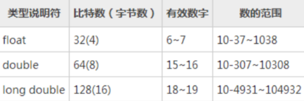

Precision and Scale details.

 

**Definition and Example**: Precision is the number of digits in a number. Scale is the number of digits to the right of the decimal point in a number. For example, the number 123.45 has a precision of 5 and a scale of 2. Decimal data types are defined as à DECIMAL(*precision, scale*)

 

Supported precision and scale in different technologies:

 

- **AWS Glue Catalog**:     This is used in Data Lake platform which uses Parquet as storage file.     Parquet supports DECIMAL(38, 37) that AWS Glue catalog and Athena honors.
- **AWS Redshift**:     This is used in Lakefront and Lakehouse where Lakefront table structure is    1:1 with Data Lake table structure. Redshift supports DECIMAL(38, 37) for  storage.
- **Snowflake**:     This is used by external partners who works with Morningstar where   technology supports DECIMAL(38, 37) for storage
- **Microsoft SQL**:     This is used for RDB and many other legacy solutions (XOI, XII, etc.)    where the technology supports DECIMAL(38, 17) for storage
- **MySQL**:     This is used for very few legacy solutions where the technology supports  DECIMAL(65, 30) for storage

 

Regarding **IEEE 754 standard** double data type that all technology adopts uses **maximum precision 15** and scale is defined with exponent and mantissa for storage where exponent and mantissa support is based on supported processor (x64 or x32)

 

In a nutshell DECIMAL(38, 37) is very large number with very high accuracy in my mind that can be used as a ceiling if the data stored is required that level of precision across the technology stack. If this is a problem in downstream technology then downstream team would take the information from dictionary and apply their limitation (if any) as part of their communication to the end user.

float和double类型的区别如下：

1、变量类型不同

float属于单精度型浮点数据。

double属于双精度型浮点数据。

2、指数范围不同

float的指数范围为-127~128。

double而double的指数范围为-1023~1024

3、表达式指数位不同

float的表达式为1bit（符号位）+8bits（指数位）+23bits（尾数位）

double的表达式为1bit（符号位）+ 11bits（指数位）+ 52bits（尾数位）

4、占用内存空间不同

float占4个字节（32位）内存空间，其数值范围为3.4E-38～3.4E+38。

double占8 个字节（64位）内存空间，其数值范围为1.7E-308～1.7E+308。

5、有效位数不同

float只能提供七位有效数字。

double可提供16位有效数字。