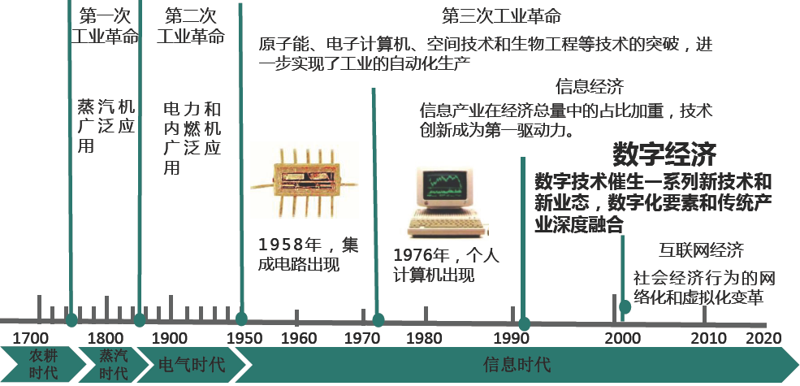
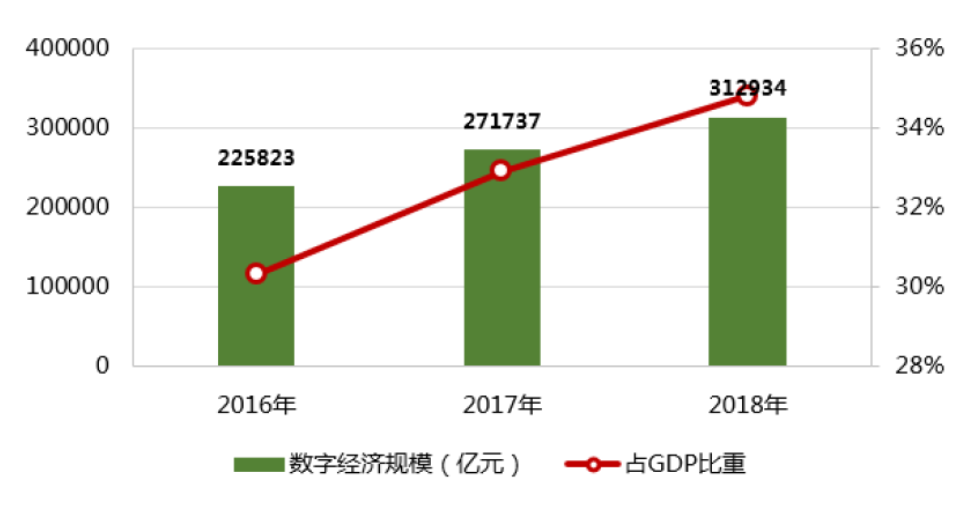
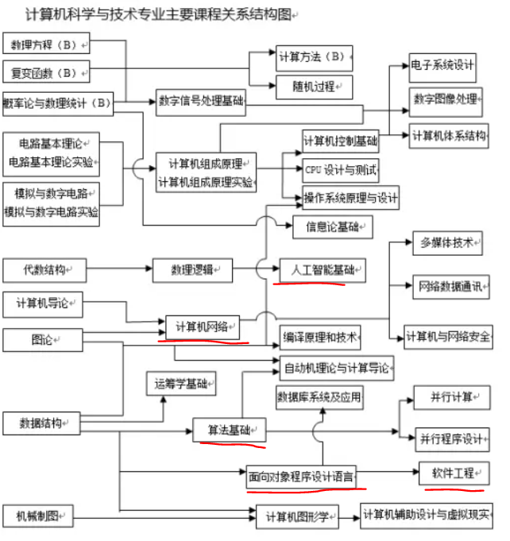
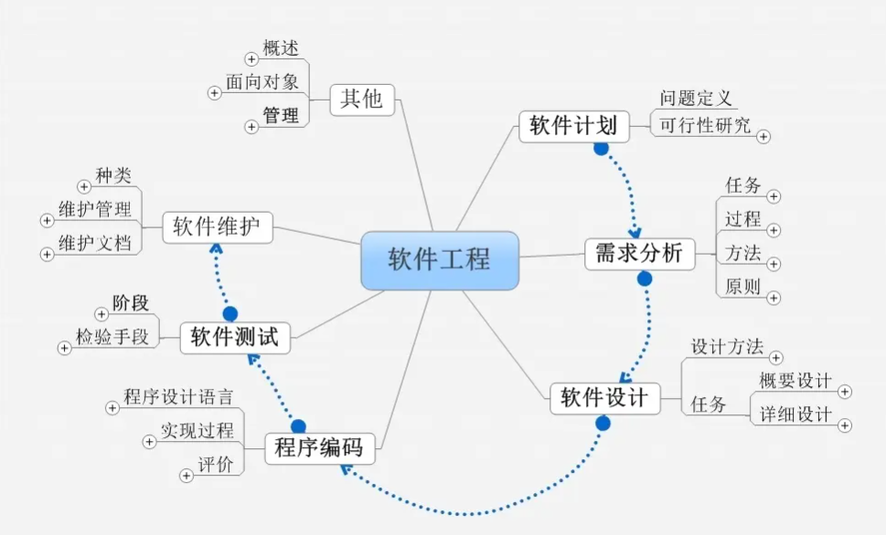
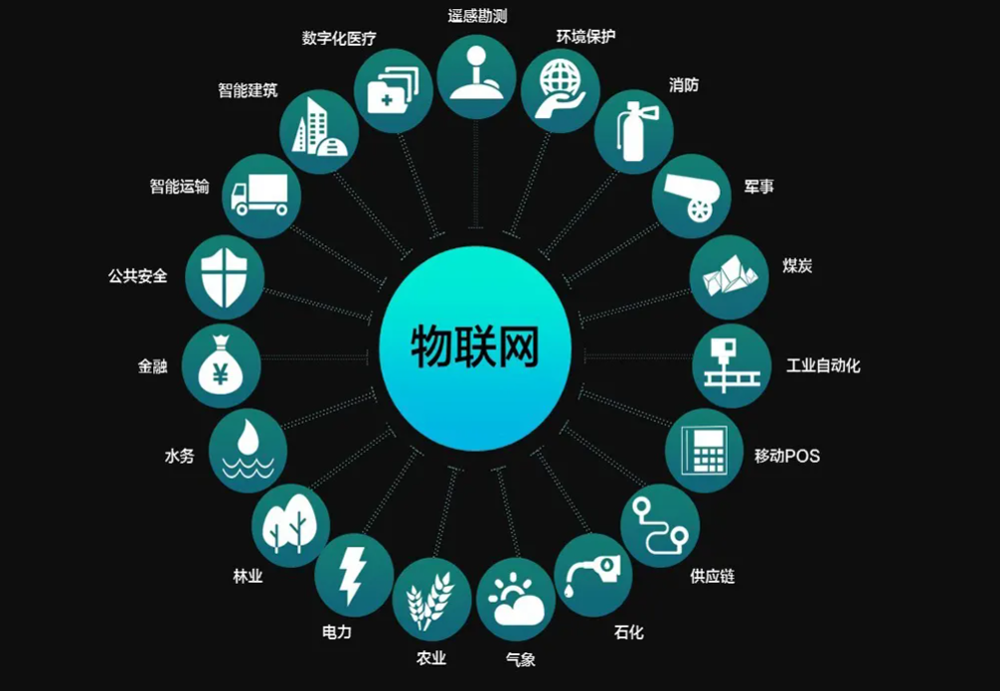
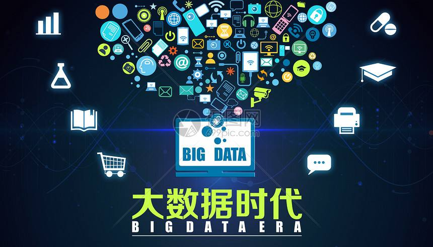
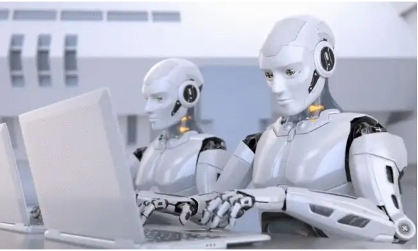
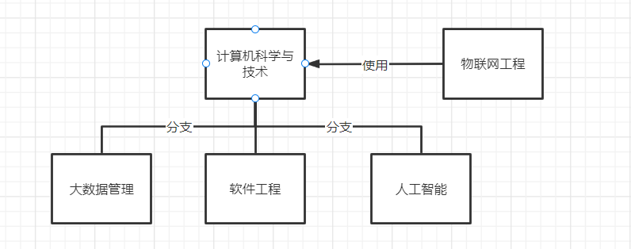

# 数据经济

数字经济是人类通过大数据（**数字化的知识与信息**）的识别—选择—过滤—存储—使用，引导、实现**资源的快速优化配置与再生**、实现**经济高质量发展**的经济形态。

国家统计局2021年06月03日公布了《数字经济及其核心产业统计分类（2021）》，首次确定了数字经济的基本范围。

《数字经济分类》从**“数字产业化”**和**“产业数字化”**两个方面，确定了数字经济的基本范围，将其分为 **数字产品制造业**、**数字产品服务业**、**数字技术应用业**、**数字要素驱动业**、**数字化效率提升业**等5大类。

其中，前4大类为数字产业化部分，即**数字经济核心产业**，是指为**产业数字化发展提供数字技术、产品、服务、基础设施和解决方案**，以及完全依赖于数字技术、数据要素的各类经济活动，对应于《国民经济行业分类》中的26个大类、68个中类、126个小类，是**数字经济发展的基础**。

第5大类为**产业数字化**部分，是指**应用数字技术和数据资源为传统产业带来的产出增加和效率提升，是数字技术与实体经济的融合**。该部分涵盖智慧农业、智能制造、智能交通、智慧物流、数字金融、数字商贸、数字社会、数字政府等数字化应用场景，对应于《国民经济行业分类》中的91个大类、431个中类、1256个小类，体现了数字技术已经并将进一步与国民经济各行业产生深度渗透和广泛融合。

在《数字经济分类》中，**数字产业化和产业数字化形成了互补关系。**以制造业为例，**数字产品制造业**是指支撑数字信息处理的终端设备、相关电子元器件以及高度应用数字化技术的智能设备的制造，属于“数字产业化”部分，包括计算机制造、通讯及雷达设备制造、数字媒体设备制造、智能设备制造、电子元器件及设备制造和其他数字产品制造业。**智能制造**是指利用数字孪生、人工智能、5G、区块链、VR/AR、边缘计算、试验验证、仿真技术等新一代信息技术与先进制造技术深入融合，旨在提高制造业质量和核心竞争力的先进生产方式，属于“**产业数字化**”部分，主要包括数字化通用专用设备制造、数字化运输设备制造、数字化电气机械器材和仪器仪表制造、其他智能制造。数字产品制造业和智能制造是按照《国民经济行业分类》划分的制造业中数字经济具体表现形态的两个方面，互不交叉，共同构成了制造业中数字经济的全部范围。

《数字经济分类》的出台为我国数字经济核算提供了统一可比的统计标准、口径和范围。下一步，国家统计局将定期开展数字经济核心产业的核算工作，为各地区各部门贯彻落实“十四五”规划《纲要》明确的数字经济核心产业发展目标提供数据支撑。

**数字经济是继农业经济、工业经济之后的主要经济形态，数字化转型正在驱动生产方式、生活方式和治理方式发生深刻变革**，对世界经济、政治和科技格局产生深远影响。作为衡量数字经济发展水平的重要统计标准，《数字经济及其核心产业统计分类（2021）》已在国家统计局网站公开发布。

## 四个发展阶段

.png)

半导体是数字经济中用于存储数据信息的主要物质载体。

微电子产业和计算机产业使数据信息成为了重要生成要素。

基础互联网开始成为振兴数字经济的法宝。

消费互联网和产业互联网是数字经济的竞争高地。

当前数字经济正在迎来裂变式发展，因此也诞生了大量的新技术，包括物联网技术，大数据技术，数据挖掘和人工智能等，这些技术也加速了数字经济的进一步发展。

## 演变过程

## 规模情况

# 计算机科学与技术

计算机科学与技术（Computer Science and Technology）是国家一级学科，下设[信息安全](https://baike.baidu.com/item/信息安全/339810)、[软件工程](https://baike.baidu.com/item/软件工程/25279)、[计算机软件与理论](https://baike.baidu.com/item/计算机软件与理论/3008761)、计算机系统结构、计算机应用技术、计算机技术等专业。

# 软件工程

软件工程是研究和应用如何以系统性的、[规范化](https://baike.baidu.com/item/规范化/3193374)的、可定量的**过程化方法去开发和维护软件**，以及如何把经过时间考验而证明正确的管理技术和当前能够得到的最好的技术方法结合起来的[学科](https://baike.baidu.com/item/学科/2634099)。它涉及到**程序设计语言**、数据库、[软件开发工具](https://baike.baidu.com/item/软件开发工具/4605523)、系统平台、标准、设计模式等方面。

Python编程是属于软件工程的一个小的方面。

# 物联网(Internet Of Things)

[物联网](https://baike.baidu.com/item/物联网)(Internet of Things)是一个**基于[互联网](https://baike.baidu.com/item/互联网/199186)**、传统电信网等信息承载体，让所有能够被**独立寻址**（唯一表示，**每个物体都有一个身份证号码**) 的普通物理对象实现互联互通的网络。

它的目的是把所有物品通过信息传感设备与互联网连接起来，进行信息交换，即物物相息，以**实现智能化识别和管理**。

你身边有哪些事物已经处于物联网之中？  请举些你熟悉的例子。

比如手机，（可以上网，手机都有一个手机号码，手机与手机直接能进行信息交互，手机除了可以打电话，发信息，还可以控制你家中的电器等等）

物联网涉及到生活中的各行各业。

一机在手，天下我有。

# 大数据管理

万物互联之后，处于物联网中的每个事物都会产生大量的数据，

大数据时代是指利用相关算法对海量数据的处理与分析、存储，**从海量的数据中发现价值**，**服务于生活与生产。**在餐饮、电信、金融、娱乐、体育等领域都能够感受到大数据对各行各业带来的影响。

# 人工智能

进入大数据时代之后，数据量剧增，单靠人工来分析和处理数据实在忙不过来，效率也比较底下，怎么样来让机器来替我们干活。

人工智能（Artificial Intelligence），[英文](https://baike.baidu.com/item/英文/3079091)缩写为AI。英文缩写AI，人工智能是研究、开发用于模拟、延伸和扩展人的智能的理论、方法、技术及应用系统W的一门新的技术科学。

人工智能是**类人行为、类人思考、理性的思考、理性的行动**。**人工智能的基础是哲学、数学、经济学、神经科学、心理学、计算机工程、控制论、语言学**。人工智能的发展经过了孕育、诞生、早期的热情、现实的困难等数个阶段。

人工智能是计算机科学的一个分支，该领域的研究包括**机器人**、**语音识别**、**图像识别**、自然语言处理和专家系统等。

# 专业之间的关系

# 参考资料

未来5年我国数字经济产业发展规模的分析 http://www.ocn.com.cn/touzi/chanye/201908/tlura08094620.shtml  

什么是数字经济？如何改变你我生活？https://m.gmw.cn/baijia/2021-06/04/1302338418.html

