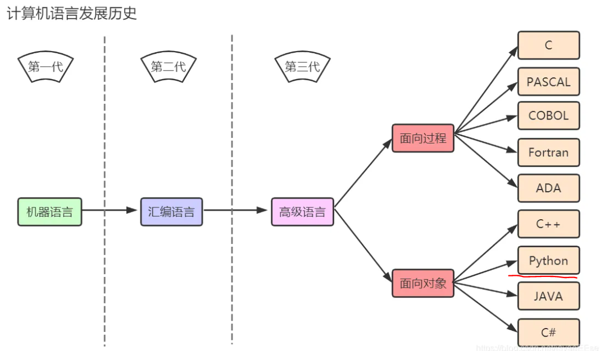
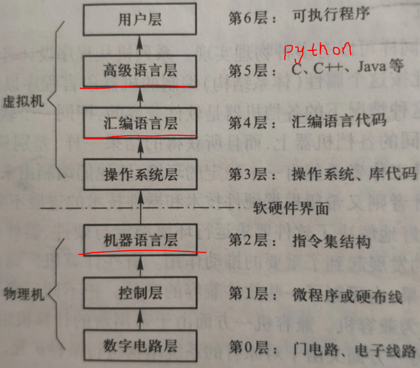
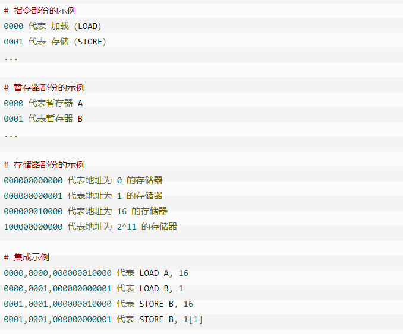
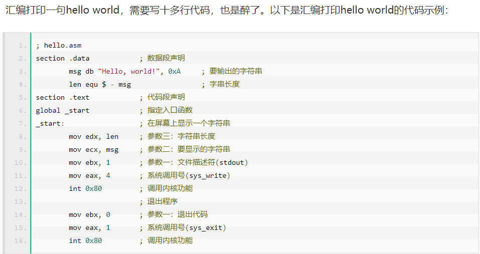
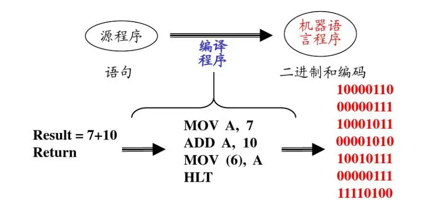
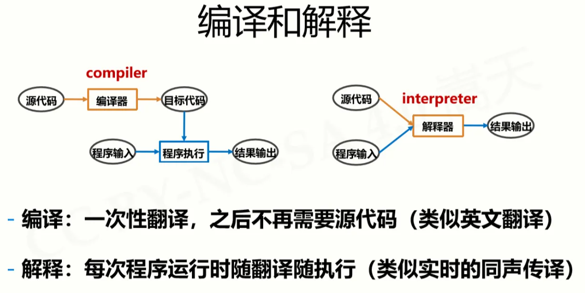
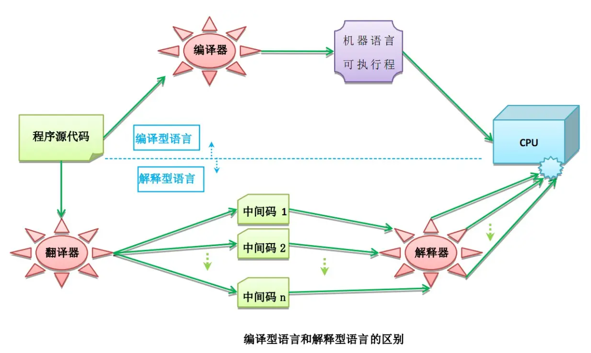

# 计算机编程语言发展历史






## 机器语言

由于计算机内部只能接受二进制代码，因此，用二进制代码0和1描述的指令称为**机器指令**，全部机器指令的集合构成计算机的机器语言，用机器语言编程的程序称为**目标程序**。只有目标程序才能被计算机直接识别和执行。但是机器语言编写的程序无明显特征，**难以记忆，不便阅读和书写**，且**依赖于具体机种**，局限性很大，**机器语言属于低级语言**。




<u>有本事你把下图的代码翻译翻译?</u>  


## 汇编语言

汇编语言类似于机器语言，但是汇编语言只是把一串二进制数写成一个英文单词。因此你**不需要去记住二进制数**，而是**需要去记住一个一个英文单词**，这同样是一个大工程，为什么？继续往下看。虽然汇编语言用英文标签代替二进制指令，本质还是在直接操作硬件。



## 高级语言

高级语言直接用人能理解的语言和语法风格编写程序，程序员无序再去考虑复杂的硬件操作。

高级语言是大多数编程者的选择。和汇编语言相比，它不但将许多相关的机器指令合成为单条指令，并且去掉了与具体操作有关但与完成工作无关的细节，例如使用堆栈、寄存器等，这样就**大大简化了程序中的指令**。同时，由于省略了很多细节，**编程者也就不需要有太多的专业知识**。

```python
print('hello world')
```


在高级语言问世的同时，问题也来了，我们用**高级语言编写的程序归根结底还是要给计算机执行**，但是**计算机只认识二进制指令**。这就涉及到一个翻译的过程，我们需要**把人用高级语言编写的程序翻译成计算机所能理解的二进制指令才执行**，按照翻译方式的不同，高级语言又分为**编译型**和**解释型**两大类。

### 





**python是解释型高级编程语言。**

# 参考资料

编程语言分类 https://www.w3xue.com/exp/article/20194/31956.html