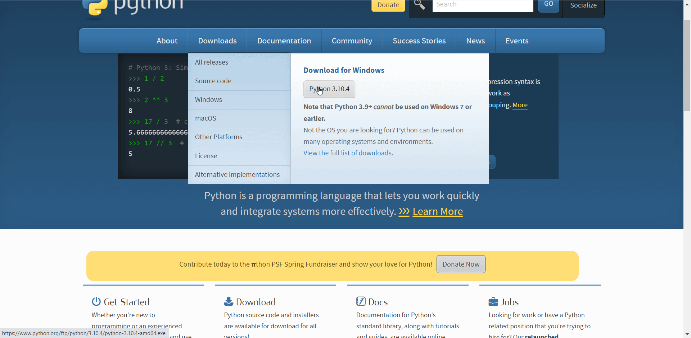
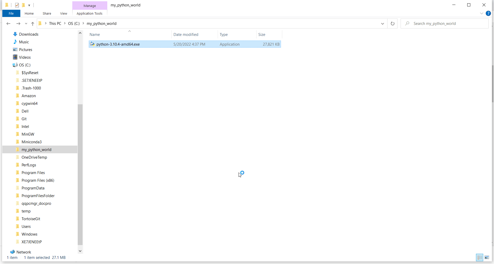
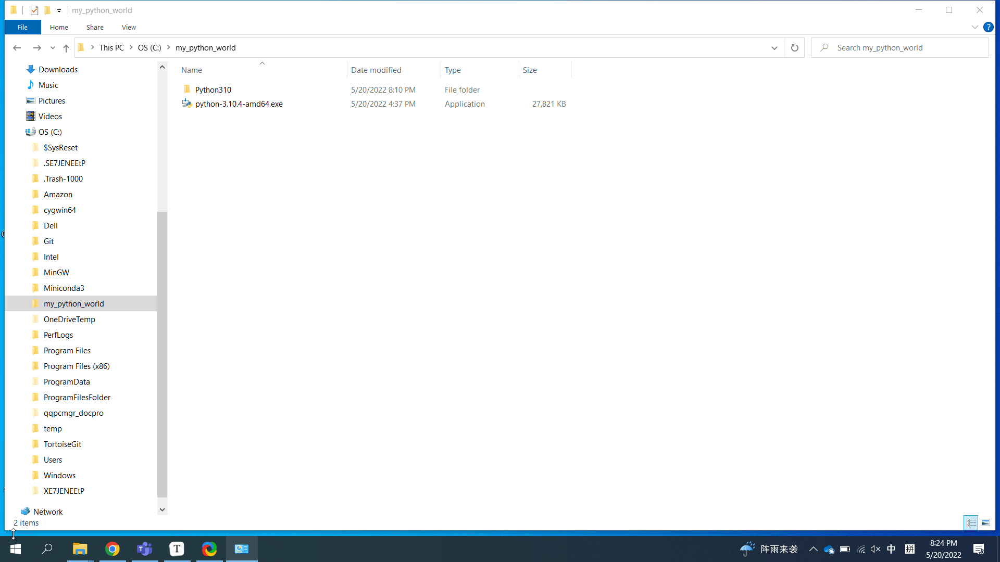
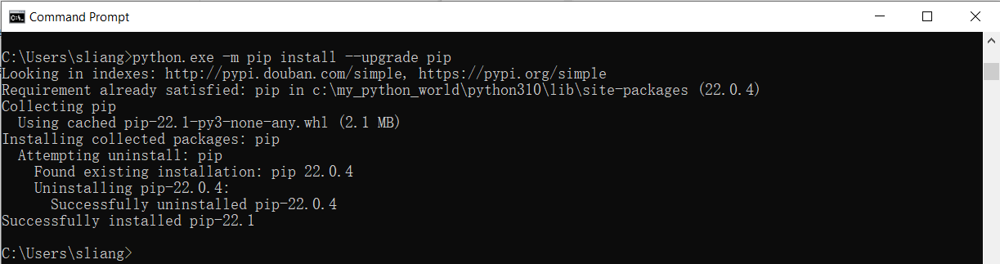
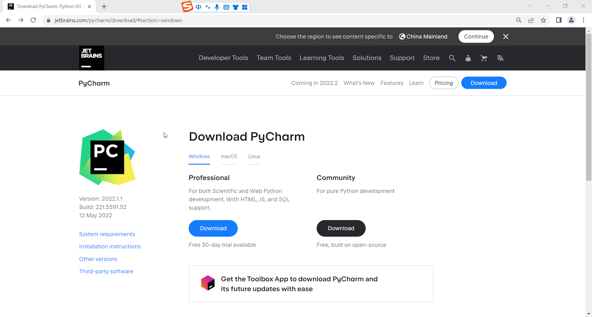
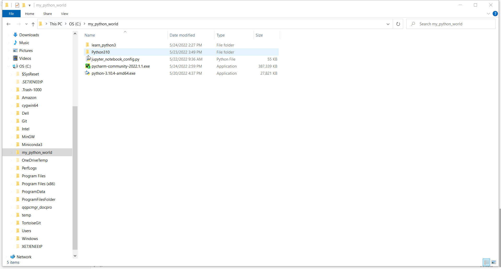

# 配置本地工作环境
## 创建本地目录

进入`C`盘，创建`my_python_world`目录， 如下图所示： 

## 下载python3安装包

点击 https://www.python.org/ 打开浏览器(推荐使用Google Chrome) 进入python的官方网站，下载最新版本的64位的python安装包，下载完之后，把它复制到`C:\my_python_world` 目录下， 如下图所示：  

## 安装python3

进入`C:\my_python_world`，鼠标左键双击python安装包，把python安装到`c:\my_python_world\Python310目录，如下图所示：

## 运行python3

打开命令行窗口，输入`python` ，检查显示的python版本和你安装包的版本是否一致,  如下图所示：

## 更新pip版本

打开命令行窗口，输入`python.exe -m pip install --upgrade pip`, 如下图所示：

## Pycharm(IDE)

PyCharm是一种[Python](https://baike.baidu.com/item/Python/407313) [IDE](https://baike.baidu.com/item/IDE/8232086)（Integrated Development Environment，集成开发环境），带有一整套可以帮助用户在使用Python语言开发时提高其效率的工具，比如[调试](https://baike.baidu.com/item/调试/5852756)、[语法高亮](https://baike.baidu.com/item/语法高亮/9686751)、[项目管理](https://baike.baidu.com/item/项目管理/85389)、代码跳转、智能提示、自动完成、[单元测试](https://baike.baidu.com/item/单元测试/1917084)、[版本控制](https://baike.baidu.com/item/版本控制/3311252)。

### 下载pycharm

点击 https://www.jetbrains.com/pycharm/download/#section=windows  打开浏览器(推荐使用Google Chrome) 进入pycharm的官方网站，下载最新社区(community) 版本的pycharm安装包，下载完之后，把它复制到`C:\my_python_world` 目录下，如下图所示：

### 安装pycharm

进入`C:\my_python_world`，鼠标左键双击pycharm安装包，把pycharm安装到`c:\my_python_world\下目录，如下图所示：

