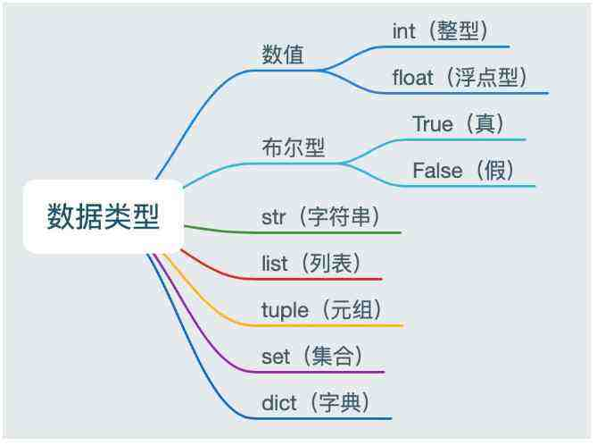

# 第一个python程序

`hello_python.py`

# 如何定义变量和方法

# 变量

## 概念

变量是存放数据值的容器。

## 常用数据类型

- 数值类型

  整型,  比如 age = 10

  浮点型,  比如 score = 98.5

- 布尔类型

  is_ok = True 或者 is_ok = False

- 字符串类型

  比如 name = '王小二'

- 列表类型

  To Do

- 元组类型

  To Do

- 集合类型

  To Do

- 字典类型

  To Do

# 函数

## 概念

由若干语句组成的语句块、函数名称、参数列表和返回值构成，具有独立功能的代码块称为函数。

在结构化编程中，函数是对代码的最基本的封装，一般都是按照功能来封装，封装是为了可以开发程序可以重复使用，减少相同功能代码的[冗余](https://so.csdn.net/so/search?q=冗余&spm=1001.2101.3001.7020)，提高编写代码的效率，代码更加简洁，可读性强。

# python解析器运行原理

