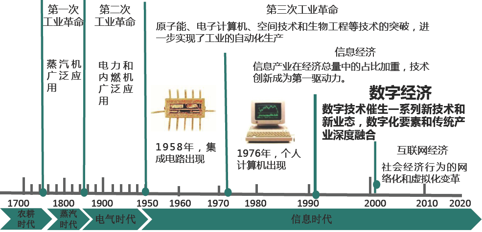
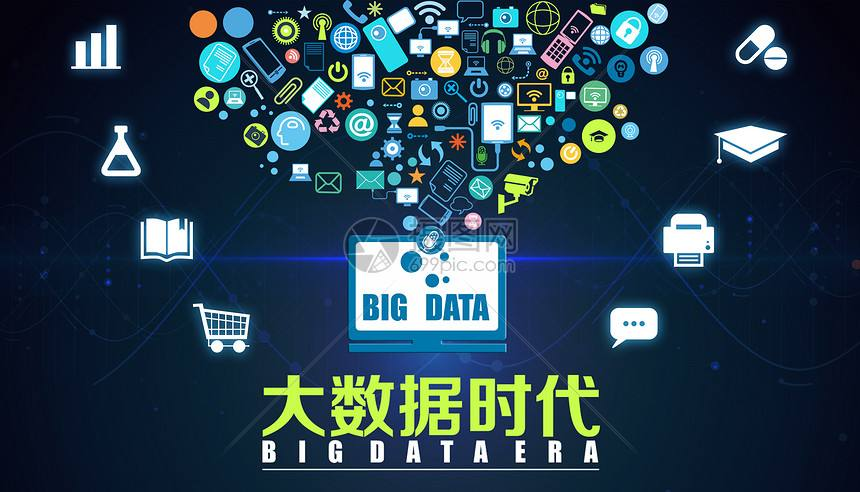

# 数据经济

数字经济是人类通过大数据（**数字化的知识与信息**）的识别—选择—过滤—存储—使用，引导、实现**资源的快速优化配置与再生**、实现**经济高质量发展**的经济形态。

## 四个发展阶段

.png)

半导体是数字经济中用于存储数据信息的主要物质载体。

微电子产业和计算机产业使数据信息成为了重要生成要素。

基础互联网开始成为振兴数字经济的法宝。

消费互联网和产业互联网是数字经济的竞争高地。

当前数字经济正在迎来裂变式发展，因此也诞生了大量的新技术，包括物联网技术，大数据技术，数据挖掘和人工智能等，这些技术也加速了数字经济的进一步发展。

## 演变过程

# 物联网(Internet Of Things)

# 大数据时代

## 1. 大数据时代

大数据时代是指利用相关算法对海量数据的处理与分析、存储，从海量的数据中发现价值，服务于生活与生产。在餐饮、电信、金融、娱乐、体育等领域都能够感受到大数据对各行各业带来的影响。

## 2. 大数据时代有哪些特点？

（1）信息量庞大

所谓的大数据时代，从字面意义上就不难理解，数据非常大，信息量比较庞大，这也是互联网迅速发展所带来的改变。仅从通讯上面我们就能够看出来，以前的2G、3G就能够满足人们使用，到后来的4G，网络的发展，人们能够通过互联网获取的信息越来越多，现在又开始推出5G，大数据的时代，毕竟容纳和接受更多的信息。

（2）多样化

大数据时代的我们会有这样一个感受，就是自己不知道的东西都能够通过网络搜索来获取，在网上我们能够看到各种各样的信息，这便是大数据时代的多样性带给我们的不一样的感受。我们工作的时候，有工作的软件，下班放松娱乐，也有相关的软件和信息。

（3）高速高流动性

以前网络发展慢，相互之间进行数据传输和信息传送可能需要很长的一段时间，人们之间的沟通和交流并没有多么明显的改善，而大数据时代的慢慢到来，我们便不难发现，以前需要很长时间才能够传输完成的文件，现在几秒钟就能完成，但这也对信息的精密度和服务器的运行平稳提出的了很大的挑战。

（4）共享性

在网络不发达的时间，我们获得新知识或者新经验的方式，只能够是自己摸索或者请教有经验的人，而现在，我们在网上能够随时找到很多自己想要的领域的知识分享。不仅如此，在某些领域，也能够通过网络进行交流和商讨，而不是非要面对面进行。

# 数据挖掘和人工智能

# 参考资料

未来5年我国数字经济产业发展规模的分析 http://www.ocn.com.cn/touzi/chanye/201908/tlura08094620.shtml  

什么是数字经济？如何改变你我生活？https://m.gmw.cn/baijia/2021-06/04/1302338418.html

