# 计算机组成

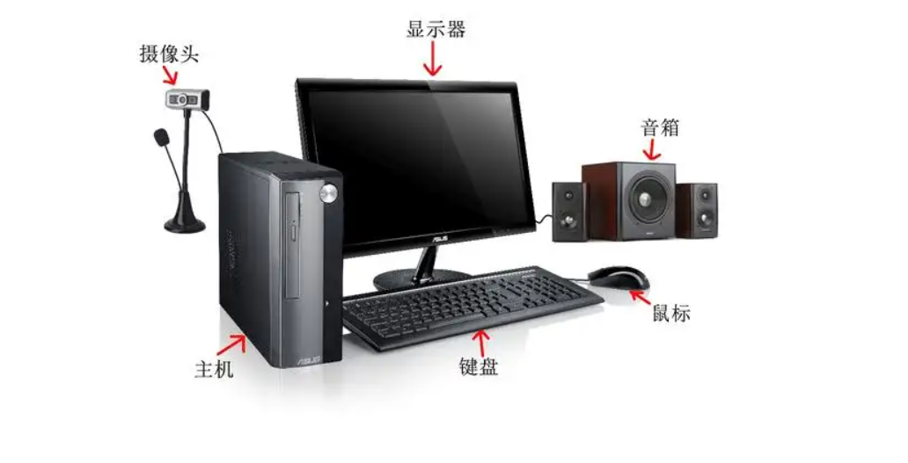

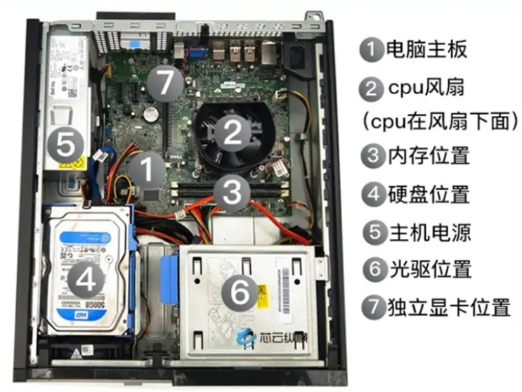

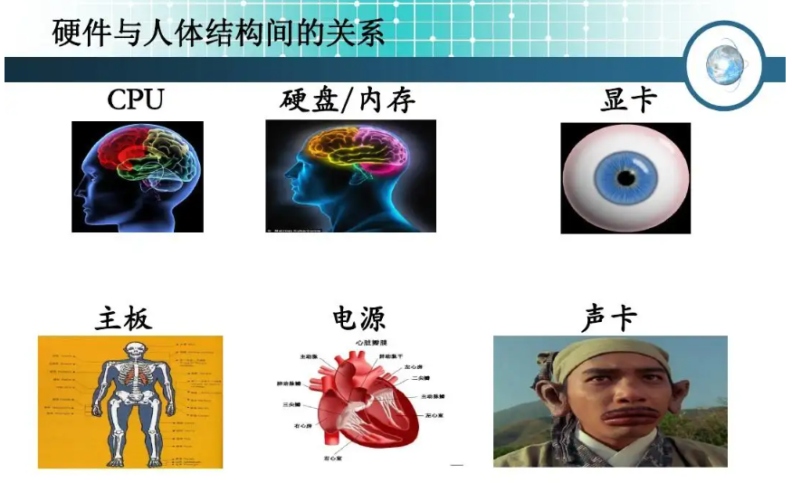

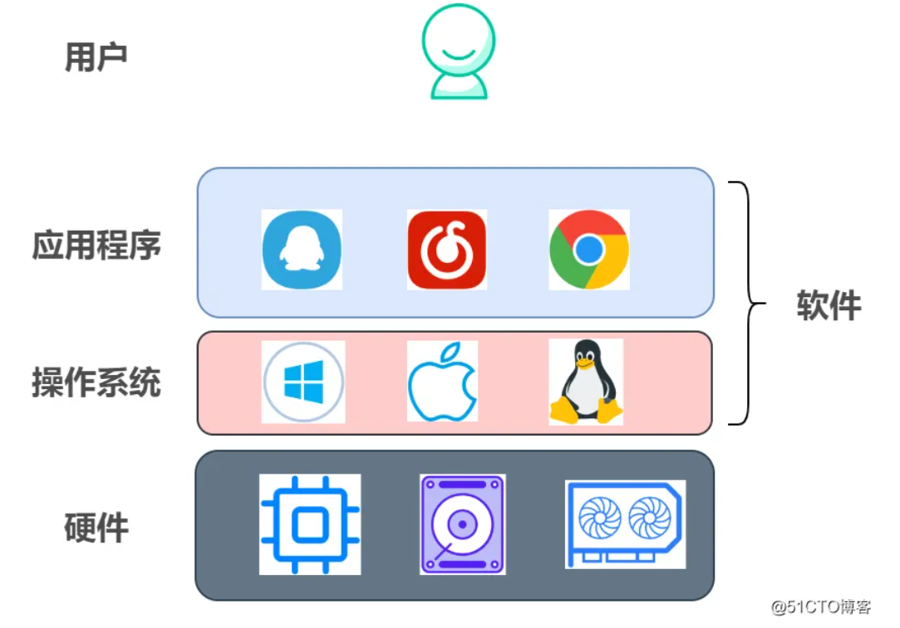

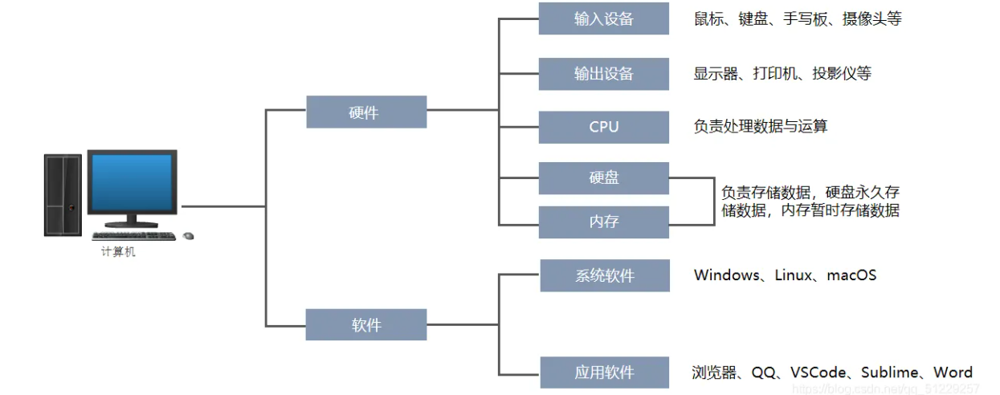

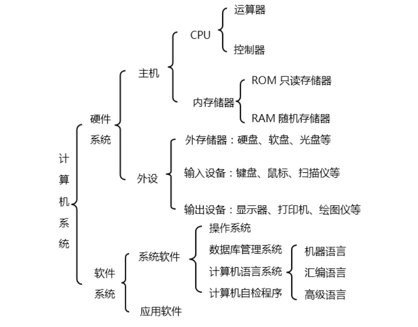

**python语言是高级语言。**

# 操作系统

操作系统一般用来控制硬件，把对硬件复杂的操作封装成一个简单又优美的接口，给用户或应用程序使用。也就是说，但凡需要用硬件的地方，都需要用到操作系统。

## QQ启动的详细流程(Windows)

1. 双击Windows桌面的QQ图标(qq.exe对应路径的快捷方式)
2. 双击图标就是给操作系统发送指令，告诉操作系统QQ软件对应的硬盘地址，并让操作系统启动这个路径
3. 操作系统接收到指令操控CPU发送指令给内存
4. 内存接受指令后发送指令给硬盘，硬盘读取QQ软件代码给内存，QQ启动

# 计算机网络

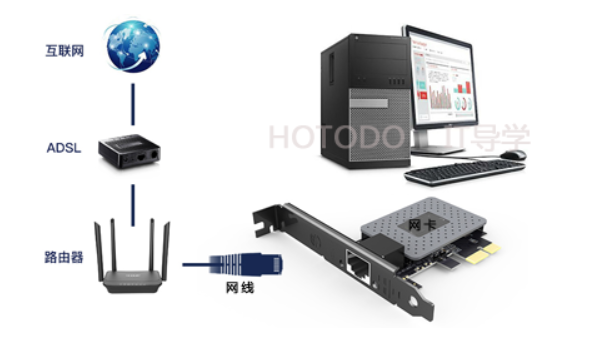

# 什么是二进制

二进制就是计算技术中被广泛采用的一种数制。

二进制的特点

1、它由两个数码0，1组成，二进制数运算规律是逢二进一。

2、二进制数的书写通常在数的右下方注上基数2，或加后面加B表示。

二进制的优点

1、**二进制数中只有两个数码0和1**，可用具有两个不同稳定状态的元器件来表示一位数码。例如，电路中某一通路的电流的有无，某一节点电压的高低，晶体管的导通和截止等。

2、二进制数运算简单，大大简化了**计算中运算部件的结构**。

3、二进制天然**兼容逻辑运算**。

二进制的缺点：二进制计数在日常使用上位数往往很长，读写不便。

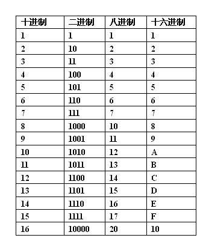

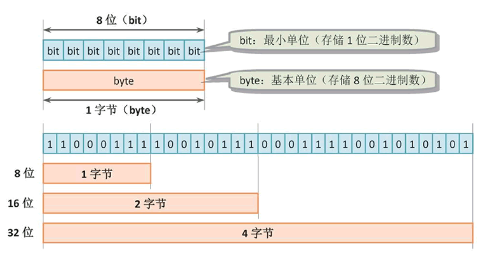

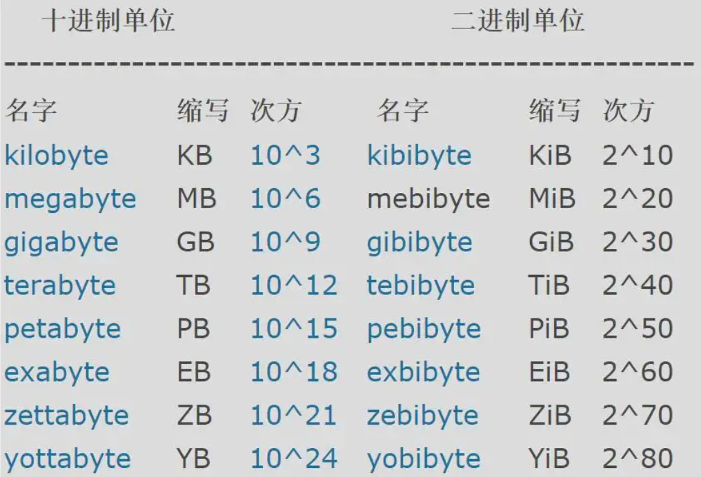

> **扩展资料：**
>
> 二进制位基础运算
>
> 1. **按位与（&）**
>
> 位运算实质是将参与运算的数字转换为二进制，而后逐位对应进行运算。
>
> 按位与运算为：两位全为1，结果为1，即1&1=1，1&0=0，0&1=0，0&0=0。
>
> 例如51 & 5 -> 00110011 & 00000101 = 00000001 -> 51 & 5 = 1
>
> 特殊用法：
>
> （1）与0相与可清零。
>
> （2）与1相与可保留原值，可从一个数中取某些位。例如需要取10101110中的低四位，10101110 & 00001111 = 00001110，即得到所需结果。
>
> 2. **按位或（|）**
>
> 两位只要有一位为1，结果则为1，即1|1=1，1|0=1，0|1=1，0|0=0。
>
> 特殊用法：
>
> （1）与0相或可保留原值。
>
> （2）与1相或可将对应位置1。例如，将X=10100000的低四位置1，使X | 00001111 = 10101111即可。
>
> 3. **异或运算（^）**
>
> 两位为“异”，即一位为1一位为0，则结果为1，否则为0。即1^1=1，1^0=0，0^1=0，0^0=1。
>
> 特殊用法：
>
> （1）使指定位翻转：找一个数，对应X要翻转的各位为1，其余为0，使其与X进行异或运算即可。例如，X=10101110，使低四位翻转，X ^ 00001111 = 10100001。
>
> （2）与0相异或保留原值。例如X ^ 00000000 = 10101110。
>
> （3）交换两变量的值。（比借助容器法、加减法效率高）原理：一个数对同一个数连续两次进行异或运算，结果与这个数相等。
>
> 因此，交换方法为：A = A ^ B，B = A ^ B，A = A ^ B。
>
> 4. **取反（~）**
>
> 将一个数按位取反，即~ 0 = 1，~ 1 = 0。
>
> 5. **左移（<<）**
>
> 将一个数左移x位，即左边丢弃x位，右边用0补x位。例：11100111 << 2 = 10011100。
>
> 若左移时舍弃的高位全为0，则每左移1位，相当于该数十进制时乘一次2。
>
> 例：11(1011) << 2 = 44（11表示为1011时实际上不完整，若计算机中规定整型的大小为32bit，则11的完整二进制形式为00000000 00000000 0000000 00001011）
>
> 6. **右移（>>）**
>
> 将一个数右移若干位，右边舍弃，正数左边补0，负数左边补1。每右移一位，相当于除以一次2。
>
> 例：4 >> 2 = 1，-14 >> 2 = -4。
>
> 7. **无符号右移（>>>）**
>
> 将一个数右移若干位，左边补0，右边舍弃。

# 计算机工作原理

计算机工作核心：存储程序和控制程序

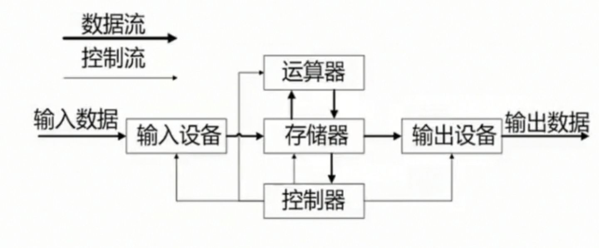

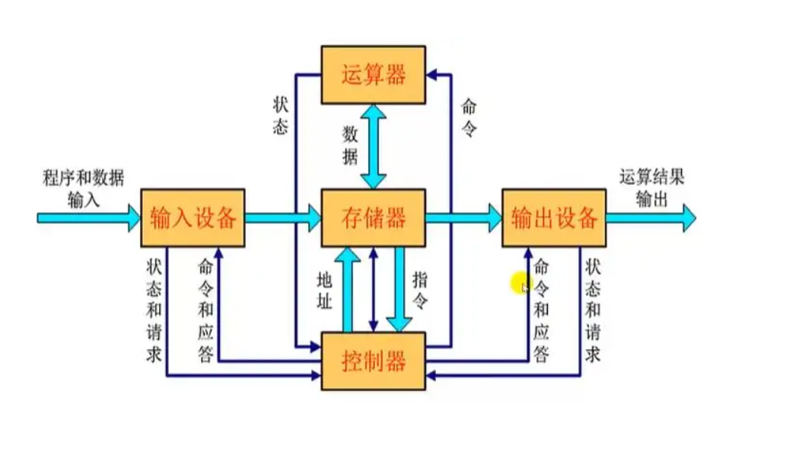

计算机工作过程：

第一步：将程序和数据通过输入设备送入存储器。 

第二步：启动运行后，计算机从存储器中取出程序指令送到控制器去识别，分析该指令要做什么事。 

第三步：控制器根据指令的含义发出相应的命令，将存储单元中存放的操作数据取出送往运算器进行运算，再把运算结果送回存储器指定的单元中。

第四步：当运算任务完成后，就可以根据指令将结果通过输出设备输出。

整个过程由控制器协调程序的顺利进行。 控制指令和存储都是使用**二进制**来进行表示。

由这个工作过程我们可以得知计算机的性能主要和**存储器和CPU**（控制器和运算器）有关

1. **存储器（内存条）**

金士顿是世界上最大的独立内存模块制造商，以提供高质量的内存产品而闻名。  

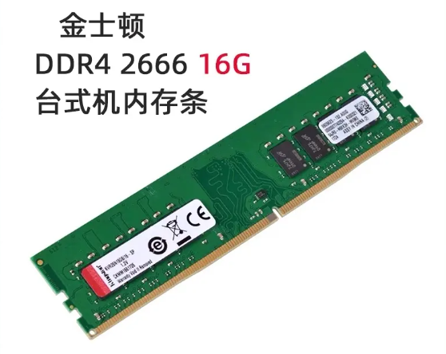

存取周期：将指令存取到存储器的时间。存取周期越短，速度越快

存取容量；即内存容量，所能存取的数据和运行的程序就越多，运行速度就越快

2.  **CPU**(Central Process Unit) - 中央处理器

目前主流的CPU就两家，一个品牌是intel，另一个品牌是AMD。

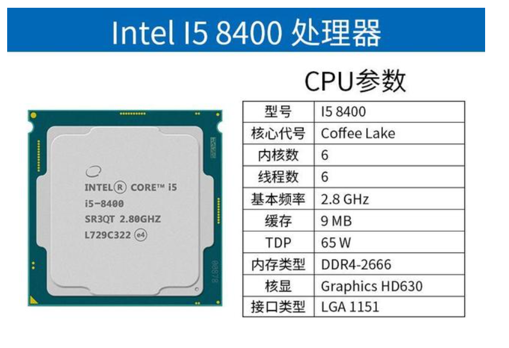

**字节** 计算机可以直接处理**二进制**数据的位数，计算机字节都是2的次方，如32位，64位等，**字节直接影响计算机的精度速度和功能**。字节越长，计算机处理能力越强。现在主流的CPU都是64位的。

**主频** CPU单位时间内发出的脉冲数，决定计算机的运算速度。主频越快，计算机的运算速度越快

**运算速度**；计算机每分钟所能执行的指令条数

**核数**；一个CPU上的运算器的个数。一台计算机的控制器个数是确定的，双核表示一个控制器两个计算器，四核表示一个控制器四个计算器 以此类推 核数越高 计算速度越快

**内存条和CPU的必须相互兼容，否则计算机无法正常工作。**

3. **其他因素** 此外，计算机的非主要性能就在输入设备和输出设备了，例如键盘 触摸屏 鼠标及屏幕的大小及分辨率等