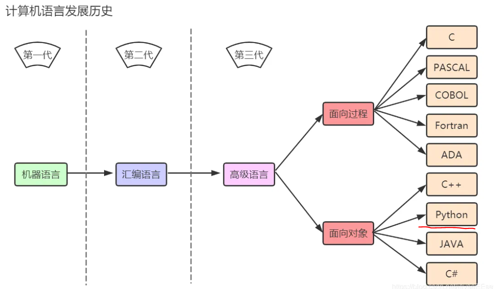
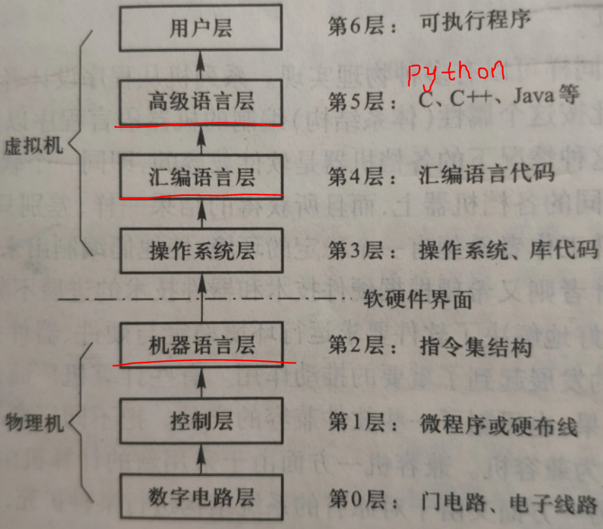
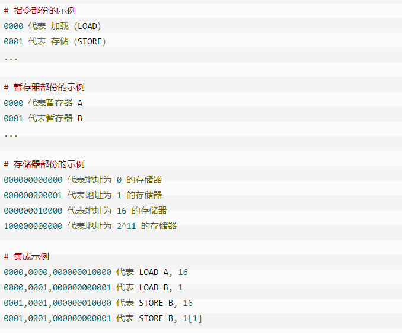
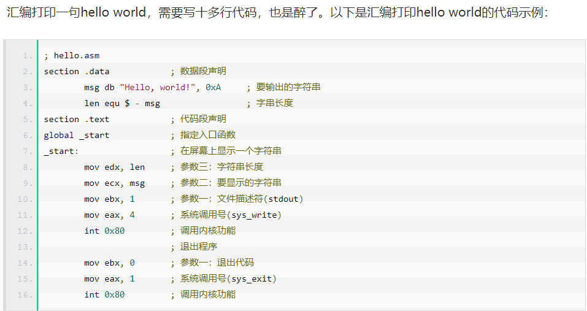
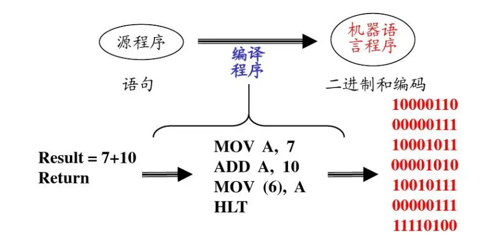
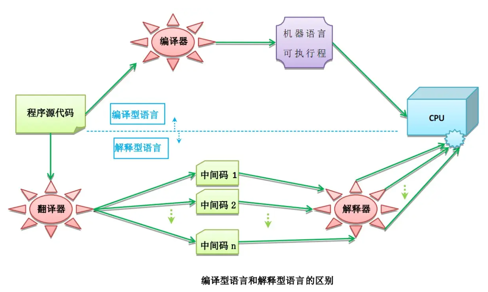

# 计算机编程语言发展历史






## 机器语言

由于计算机内部只能接受二进制代码，因此，用二进制代码0和1描述的指令称为**机器指令**，全部机器指令的集合构成计算机的机器语言，用机器语言编程的程序称为**目标程序**。只有目标程序才能被计算机直接识别和执行。但是机器语言编写的程序无明显特征，**难以记忆，不便阅读和书写**，且**依赖于具体机种**，局限性很大，**机器语言属于低级语言**。




<u>有本事你把下图的代码翻译翻译?</u>  


## 汇编语言

汇编语言类似于机器语言，但是汇编语言只是把一串二进制数写成一个英文单词。因此你**不需要去记住二进制数**，而是**需要去记住一个一个英文单词**，这同样是一个大工程，为什么？继续往下看。虽然汇编语言用英文标签代替二进制指令，本质还是在直接操作硬件。



## 高级语言

高级语言直接用人能理解的语言和语法风格编写程序，程序员无序再去考虑复杂的硬件操作。

高级语言是大多数编程者的选择。和汇编语言相比，**它不但将许多相关的机器指令合成为单条指令**，并且去掉了与具体操作有关但与完成工作无关的细节，例如使用堆栈、寄存器等，这样就**大大简化了程序中的指令**。同时，由于省略了很多细节，**编程者也就不需要有太多的专业知识**。

```python
# python源代码
print('hello world')
```

在高级语言问世的同时，问题也来了，我们用**高级语言编写的程序归根结底还是要给计算机执行**，但是**计算机只认识二进制指令**。这就涉及到一个翻译的过程，我们需要**把人用高级语言编写的程序翻译成计算机所能理解的二进制指令才执行**，按照翻译方式的不同，高级语言又分为**编译型**和**解释型**两大类。

### 




### 编译型

编译是指在应用源程序执行之前，就将程序源代码“翻译”成目标代码（机器语言），因此其目标程序可以脱离其语言环境独立执行(编译后生成的可执行文件，是CPU可以理解的2进制的机器码组成的)，使用比较方便、效率较高。但应用程序一旦需要修改，必须先修改源代码，再重新编译生成新的目标文件（* .obj，也就是OBJ文件）才能执行，只有目标文件而没有源代码，修改很不方便。编译后程序运行时不需要重新翻译，直接使用编译的结果就行了。程序执行效率高，依赖编译器，跨平台性差些。如C、C++、Delphi等。

### 解释型

执行方式类似于我们日常生活中的“同声翻译”，应用程序源代码一边由相应语言的**解释器“翻译”成目标代码（机器语言）**，**一边执行**，因此效率比较低，而且不能生成可独立执行的可执行文件，应用程序不能脱离其**解释器**(想运行，必须先装上解释器，就像跟老外说话，必须有翻译在场)，但这种方式比较灵活，**可以动态地调整、修改应用程序**。如Python、Java等语言。

**python是解释型高级编程语言。**这里是一段简单的python代码：

```python
name = input('请输入你的姓名: ')
age = input('请输入你的年龄: ')

if name == 'nick':
    print('nick真jb帅')
    if int(age) == 19:
        print('nick怎么19岁了')
    else:
        print('输入有误，请尝试，nick年龄19岁')
else:
    print('输入有误，请尝试，姓名为nick')
```

```
请输入你的姓名: nick
请输入你的年龄: 19
nick真jb帅
nick怎么19岁了
```

# 主流编程语言(都是高级语言)

下图为2022年5月数据(https://www.tiobe.com/tiobe-index/ )


# 网络的瓶颈效应

**机器语言和汇编语言我们可以放弃学习**，谁想学让谁学去吧！我们重心可以放在高级语言上面，但是高级语言中的编译型语言和汇编型语言两者是互相矛盾的。这个时候对于不同的问题我们就应该有不同的策略，如果我们需要开发一个类似于操作系统这样要求执行速度并且开发周期长的系统，我们可以考虑使用编译型语言；如果我们需要开发一个跳一跳这样的娱乐软件，需要快速开发，我们可以考虑使用解释型语言。

最后，我们需要多说一嘴的是。**如果只是开发互联网程序，我们更建议使用的是解释型语言。**在了解为什么之前，我们首先给出一个木桶效应：木桶效应是讲一只水桶能装多少水取决于它最短的那块木板。好了，回归主题，将木桶效应是想告诉同学们，你在工业上开发一个项目的时候，你所开发的项目几乎都需要通过互联网传输数据。

假设一个程序使用编译型语言发送消息的执行效率为0.001ms；使用解释型语言的执行效率为0.1ms，但是，你要清楚是，互联网的网络延迟可能需要1ms，而你这靠语言节省下来的0.099ms相较于网络延迟的1ms可能无伤大雅，因为你发送第二条消息需要等网络延迟结束才能开始发送。这也就是**互联网中的瓶颈理论**。

# 参考资料

编程语言分类 https://www.w3xue.com/exp/article/20194/31956.html  https://www.cnblogs.com/nickchen121/p/10722720.html

网络的瓶颈效应 https://www.cnblogs.com/nickchen121/p/11069962.html