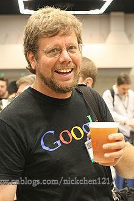
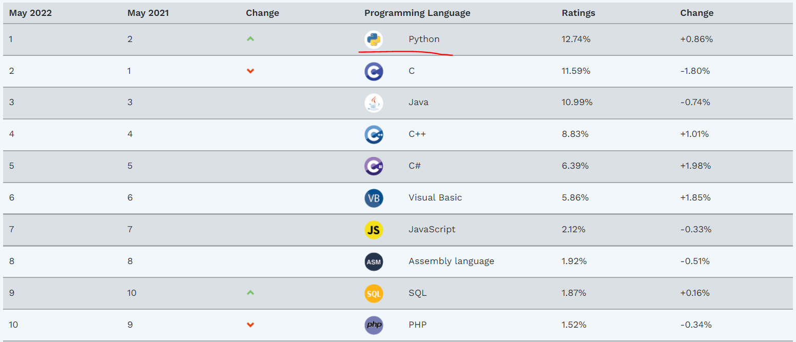

# 什么是编程语言？

Python和中文、英语语一样，都是一门语言，只要是语言，其实就可以看成是一种事物与另外一种事物沟通的介质。Python属于编程语言，**编程语言是程序猿和计算机之间沟通的介质**；中文和英语则是人与人之间沟通的介质。

# 什么是编程？

编程指的是：**程序猿基于某种编程语言的语法格式将自己脑子中的想要让计算机做的事，写到文件中。所以说编程的结果就是一堆文件，这一堆文件就是程序。**

# 为什么要编程？

计算机就像是人的奴隶，**编程的目的是想要奴役计算机，把计算机当成人类的奴隶，让计算机帮人类工作**，因而取代人力。

# Python介绍

Python的创始人为吉多·范罗苏姆（Guido van Rossum），如下图，少数几个不秃头的语言创始人。1989年的圣诞节期间，Guido为了打发圣诞节的无聊时光，开始写能够解释Python语言语法的解释器。Python这个名字，来自Guido所挚爱的电视剧Monty Python’s Flying Circus。他希望这个新的叫做Python的语言，能符合他的理想：创造一种C和shell之间，功能全面，易学易用，可拓展的语言。

最新的TIOBE排行榜，Python赶超Java排名第一。Python崇尚优美、清晰、简单，是一个优秀并广泛使用的语言。

# Python解释器发展史

Python刚问世的时候，大多数公司原有的软件是python2.+写的（这不废话吗？），由于开发软件是需要成本的，因此一些公司无法抛弃以前的代码，所以曾经在2008年推出3.+版本的python时，还需要推出2.+版本的升级版本，给公司2.+版本开发的软一段时间过度。但是公司的软件是有生命周期的，历史遗留的2.+开发的软件逐渐会消失，所以**2.+版本不再更新了，以后统一都使用3.+版本**。

- 1989年，Guido开始写Python语言的编译器。
- **1991年，第一个Python编译器诞生。**它是用C语言实现的，并能够调用C语言的库文件。从一出生，Python已经具有了：类，函数，异常处理，包含表和词典在内的核心数据类型，以及模块为基础的拓展系统。
- Granddaddy of Python web frameworks, Zope 1 was released in 1999
- Python 1.0 - January 1994 增加了 lambda, map, filter and reduce.
- Python 2.0 - October 16, 2000，加入了内存回收机制，构成了现在Python语言框架的基础
- Python 2.4 - November 30, 2004, 同年目前最流行的WEB框架Django 诞生
- Python 2.5 - September 19, 2006
- Python 2.6 - October 1, 2008
- Python 2.7 - July 3, 2010
- In November 2014, it was announced that Python 2.7 would be supported until 2020, and reaffirmed that there would be no 2.8 release as users were expected to move to Python 3.4+ as soon as possible
- Python 3.0 - December 3, 2008 (这里要解释清楚 为什么08年就出3.0，2010年反而又推出了2.7？是因为3.0不向下兼容2.0，导致大家都拒绝升级3.0，无奈官方只能推出2.7过渡版本)
- Python 3.1 - June 27, 2009
- Python 3.2 - February 20, 2011
- Python 3.3 - September 29, 2012
- Python 3.4 - March 16, 2014
- Python 3.5 - September 13, 2015
- Python 3.6 - 2016-12-23 发布Python3.6.0版
- Python 3.7 - 2018-6-27 发布Python3.7.0版
- Python 3.8 - 2019-2-4发布了Python 3.8.0.a1测试版

# Python解释器的类型

我们现在知道了Python是一门解释型语言，代码想运行，必须通过解释器执行，Python的解释器本身也可以看作是个程序（翻译官司是哪国人不重要），这个程序是什么语言开发的呢？ 答案是好几种语言？ what? 因为Python有好几种解释器，分别基于不同语言开发，每个解释器特点不同，但都能正常运行我们的Python代码，下面分别来看下各种不同类型的Python解释器的区别。

## CPython

**CPython是使用最广且被的Python解释器。**本教程以CPython为准。当我们从Python官方网站下载并安装好Python 3 后，我们就直接获得了一个官方版本的解释器：CPython。这个解释器是用C语言开发的，所以叫CPython。在命令行下运行python就是启动CPython解释器。

## IPython

IPython是基于CPython之上的一个交互式解释器，也就是说，IPython只是在交互方式上有所增强，但是执行Python代码的功能和CPython是完全一样的。好比很多国产浏览器虽然外观不同，但内核其实都是调用了IE。CPython用>>>作为提示符，而IPython用In [序号]:作为提示符。

## PyPy

PyPy是另一个Python解释器，它的目标是执行速度。PyPy采用JIT技术，对Python代码进行动态编译（注意不是解释），所以可以显著提高Python代码的执行速度。

绝大部分Python代码都可以在PyPy下运行，但是PyPy和CPython有一些是不同的，这就导致相同的Python代码在两种解释器下执行可能会有不同的结果。如果你的代码要放到PyPy下执行，就需要了解PyPy和CPython的不同点。

## Jython

Jython是运行在Java平台上的Python解释器，可以直接把Python代码编译成Java字节码执行。

## IronPython

IronPython和Jython类似，只不过IronPython是运行在微软.Net平台上的Python解释器，可以直接把Python代码编译成.Net的字节码。

# 参考资料

Python和Python解释器 https://www.cnblogs.com/nickchen121/p/10722729.html