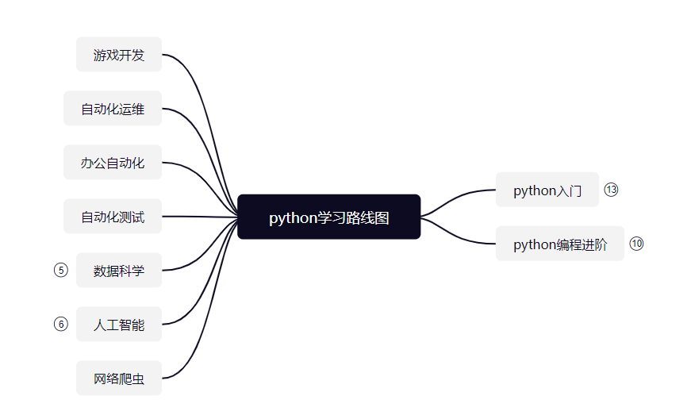
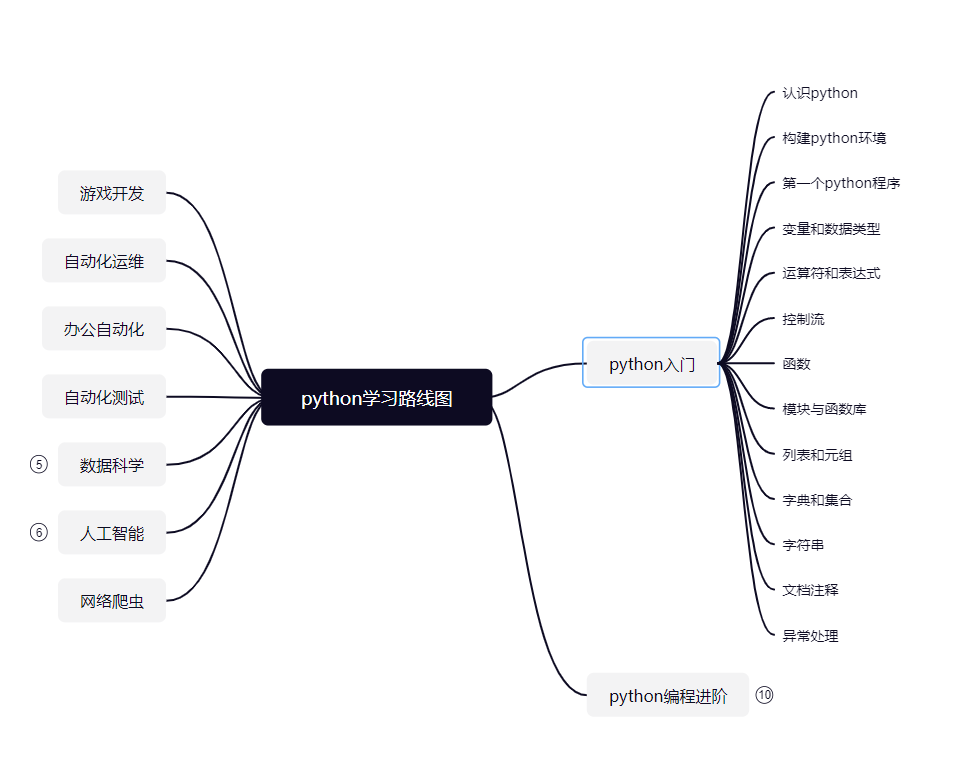
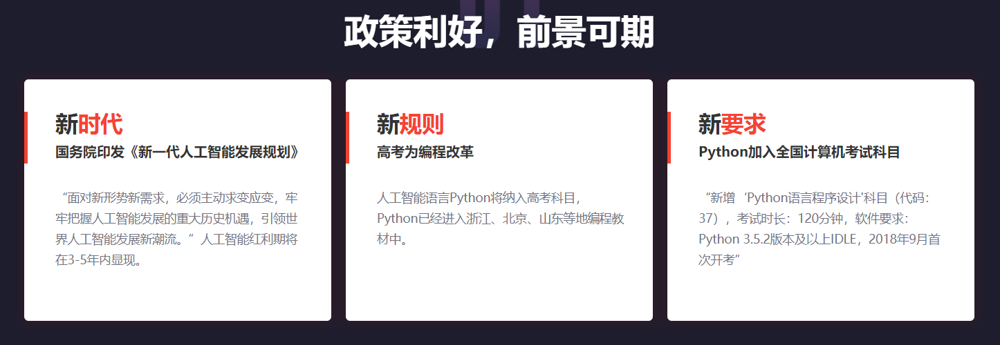
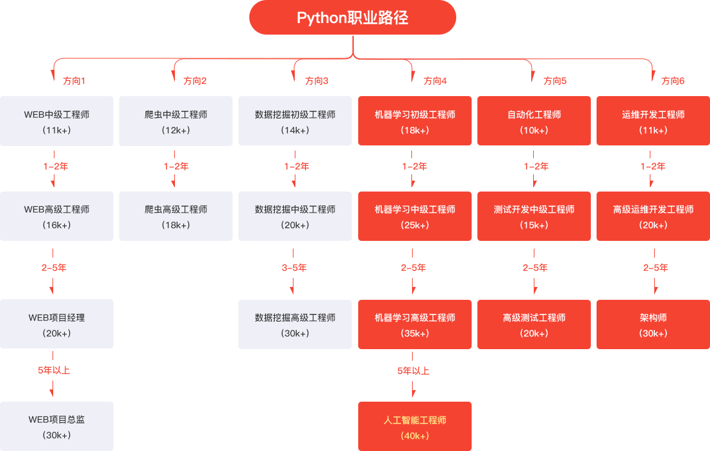
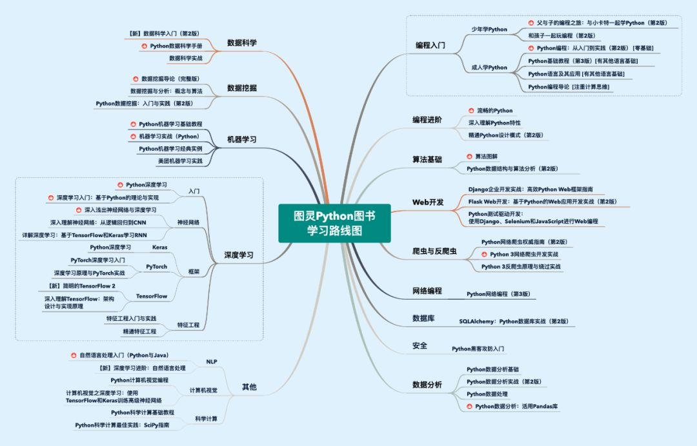

# python学习路线图

https://www.processon.com/mindmap/629fe3831e0853153226acd4

# 工程师职业路径

# 图灵Python书单

#### 

# 参考资料

图灵Python书单 https://zhuanlan.zhihu.com/p/350773263

Python工程师职业前景 http://www.makeru.com.cn/roadmap/python/details