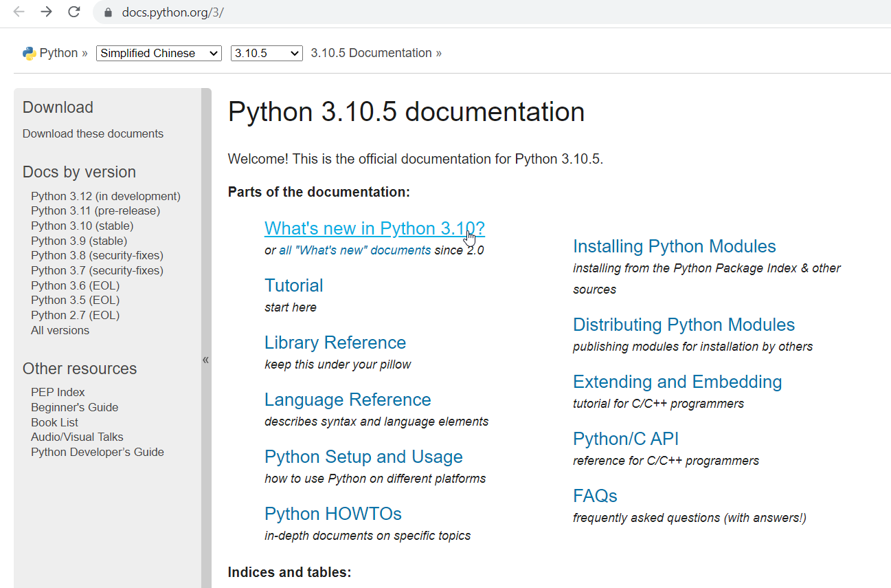
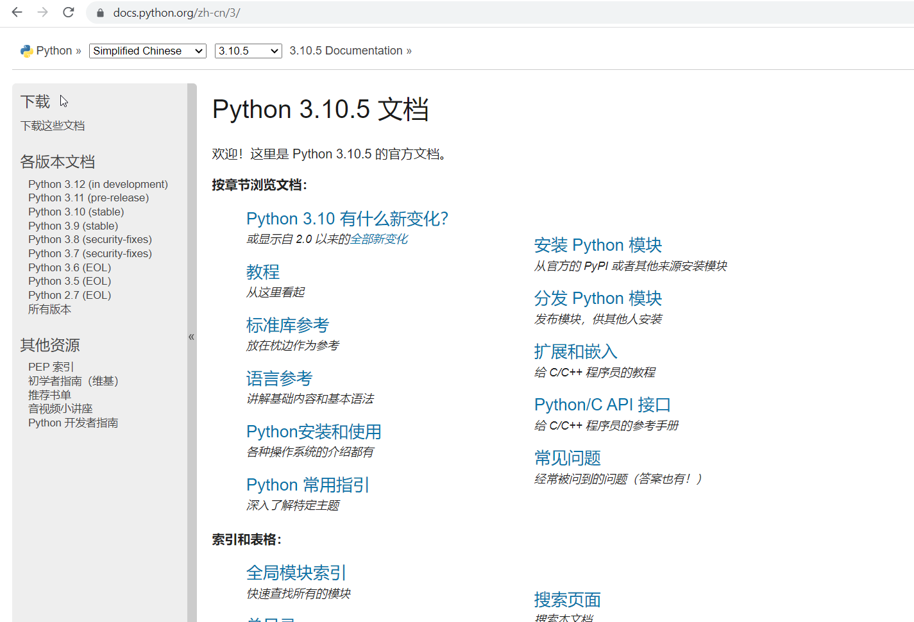
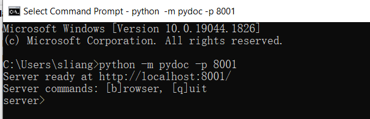
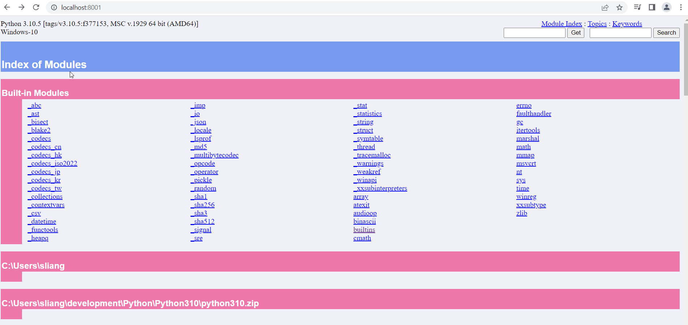
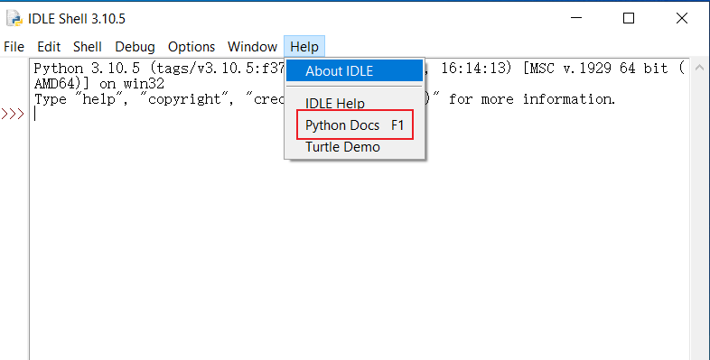
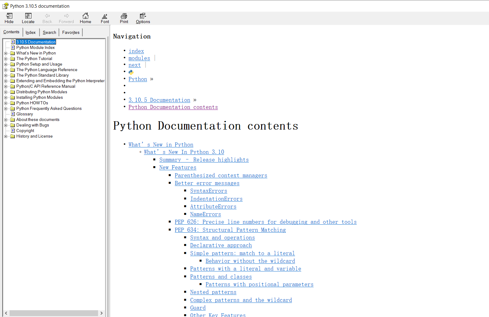
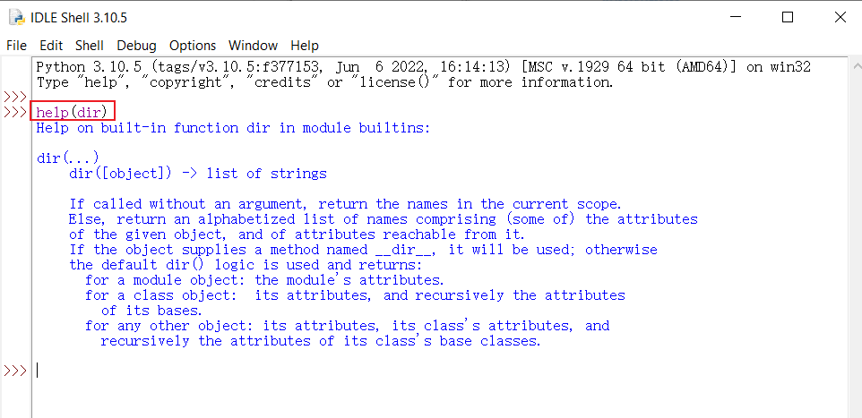
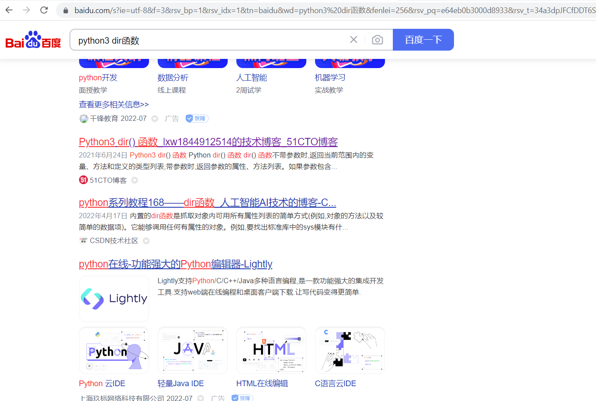
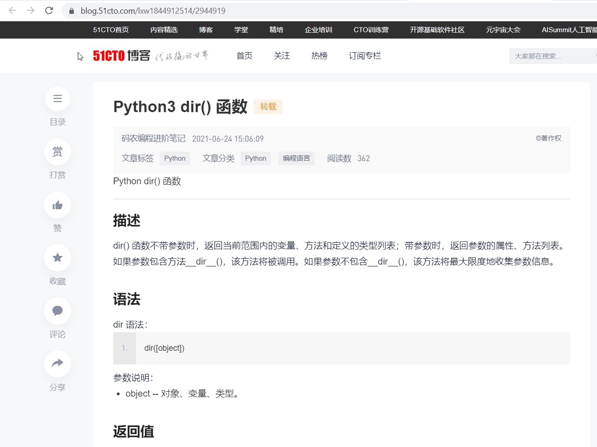

# 使用python官方文档
https://docs.python.org/3/  
默认为英文  

可以选择使用中文  
https://docs.python.org/zh-cn/3/   

# 使用pydoc模块
```commandline
python -m pydoc -p 8001
```


# 使用IDLE中的帮助



# 使用`help`函数

# 找度娘
在百度中输入关键子进行搜索  

