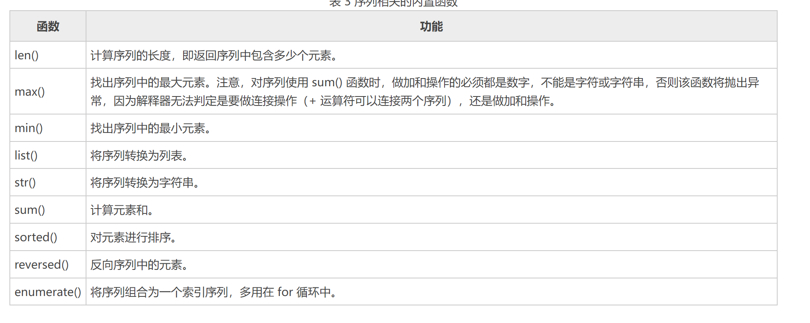

# 序列
序列，指的是一块可存放多个值的连续内存空间，这些值按一定顺序排列，可通过每个值所在位置的编号（称为索引）访问它们。

为了更形象的认识序列，可以将它看做是一家旅店，那么店中的每个房间就如同序列存储数据的一个个内存空间，每个房间所特有的房间号就相当于索引值。也就是说，通过房间号（索引）我们可以找到这家旅店（序列）中的每个房间（内存空间）。

## 序列索引
序列中，每个元素都有属于自己的编号（索引）。从起始元素开始，索引值从 0 开始递增，如图 1 所示。


图 1 序列索引值示意图

除此之外，Python 还支持索引值是负数，此类索引是从右向左计数，换句话说，从最后一个元素开始计数，从索引值 -1 开始，如图 2 所示。


图 2 负值索引示意图
注意，在使用负值作为列序中各元素的索引值时，是从 -1 开始，而不是从 0 开始。

无论是采用正索引值，还是负索引值，都可以访问序列中的任何元素。以字符串为例，访问“C语言中文网”的首元素和尾元素，可以使用如下的代码：
`seq_01.py`:   
```python
s1: str = "C语言中文网"
print(s1[0], "==", s1[-6])
print(s1[5], "==", s1[-1])
```

## 不可变序列
https://docs.python.org/zh-cn/3/library/stdtypes.html#immutable-sequence-types  

一旦创建就不可被修改。 无法使用任何更新序列的方法（比如insert，赋值等等)

字符(str), 元组(tuple), [不可变集合（frozenset）](https://docs.python.org/zh-cn/3/library/stdtypes.html#set-types-set-frozenset):    
`seq_02.py`:  
```python
s1:str = 'abcd'
print(s1)
s1[0:1] = 'n'
print(s1)

t1:tuple = (1, 2, 3)
t1.append(1)
```
## 可变序列
https://docs.python.org/zh-cn/3/library/stdtypes.html#mutable-sequence-types

列表(list), 集合(set)、字典(dict) - 映射序列。

以下表格中的操作是在可变序列类型上定义的。 [collections.abc.MutableSequence](https://docs.python.org/zh-cn/3/library/collections.abc.html#collections.abc.MutableSequence) ABC 被提供用来更容易地在自定义序列类型上正确实现这些操作。

表格中的 s 是可变序列类型的实例，t 是任意可迭代对象，而 x 是符合对 s 所规定类型与值限制的任何对象 (例如，bytearray 仅接受满足 0 <= x <= 255 值限制的整数)。


## 序列切片
https://zhuanlan.zhihu.com/p/79541418  

切片操作是访问序列中元素的另一种方法，它可以访问一定范围内的元素，通过切片操作，可以生成一个新的序列。

序列实现切片操作的语法格式如下：  
`sname[start : end : step]`

其中，各个参数的含义分别是： 
`sname`：表示序列的名称；  
`start`：表示切片的开始索引位置（包括该位置），此参数也可以不指定，会默认为 0，也就是从序列的开头进行切片；  
`end`：表示切片的结束索引位置（不包括该位置），如果不指定，则默认为序列的长度；  
`step`：表示在切片过程中，隔几个存储位置（包含当前位置）取一次元素，也就是说，如果 step 的值大于 1，则在进行切片去序列元素时，会“跳跃式”的取元素。如果省略设置 step 的值，则最后一个冒号就可以省略。

例如，对字符串“C语言中文网”进行切片：  
`seq_04.py`:  
```python
s_1="C语言中文网"
#取索引区间为[0,2]之间（不包括索引2处的字符）的字符串
print(s_1[:2])
#隔 1 个字符取一个字符，区间是整个字符串
print(s_1[::2])
#取整个字符串，此时 [] 中只需一个冒号即可
print(s_1[:])
```
备注:  
dict 和 set 不支持切片操作。

## 和序列相关的内置函数

Python提供了几个内置函数（表 3 所示），可用于实现与序列相关的一些常用操作。
   

`seq_05.py`:  
```python
s_1 = "c.biancheng.net"
# 找出最大的字符
print(max(s_1))
# 找出最小的字符
print(min(s_1))
# 对字符串中的元素进行排序
print(sorted(s_1))
# 对字符串中的元素进行排序
print(list(reversed(s_1)))


i_1 = [12, 2, 31, 4, 5]
print(sum(i_1))
print(len(i_1))

for idx, value in enumerate(i_1):
    print(idx, value)

```

# 字典
字典是一个可变序列，但是字典的键是不可变的，而值是可变的，为什么字典的键是不可变的，因为，字典这种数据结构的原理是伪随机探测的散列表，它的查找方式是将键通过哈希函数，哈希出一个值，然后在内存中查找这个值，所以哈希后的值一般是唯一的或是冲突比较小的。如果改变键的值，那么哈希后的值就会发生变化，导致找不到原来的值，所以键的值是不可变的。键哈希后指向的是内存中的地址，内存中的数据发生变化不影响字典的查找。