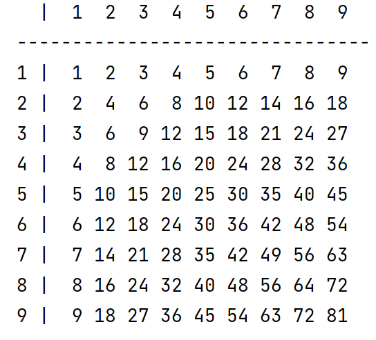

## 案例描述
在控制台中打印九九乘法表, 如下图所示: 


## 知识点提示
- `print`函数的使用
- `str.format()`函数的使用, 需要注意字符串的对齐方式。 关于format函数的使用可以参考 https://docs.python.org/zh-cn/3/library/string.html#formatstrings
- 多层`for`循环

## 源代码（仅供参考）
```
# 建立表头
print('  |', end='')
for k in range(1, 10):
    # 不自动换行，只保留空格符
    # https://docs.python.org/zh-cn/3/library/string.html#formatstrings
    # 右对齐
    print('{0:>3d}'.format(k), end='')
# 换行
print()
print('-' * 32)
# 第一层 for/in
for one in range(1, 10):
    print(one, '|', end='')
    # 第二层for/in
    for two in range(1, 10):
        # 右对齐
        print('{0:>3d}'.format(one * two), end='')
    # 换行
    print()
```
输出结果:
```
  |  1  2  3  4  5  6  7  8  9
--------------------------------
1 |  1  2  3  4  5  6  7  8  9
2 |  2  4  6  8 10 12 14 16 18
3 |  3  6  9 12 15 18 21 24 27
4 |  4  8 12 16 20 24 28 32 36
5 |  5 10 15 20 25 30 35 40 45
6 |  6 12 18 24 30 36 42 48 54
7 |  7 14 21 28 35 42 49 56 63
8 |  8 16 24 32 40 48 56 64 72
9 |  9 18 27 36 45 54 63 72 81
```