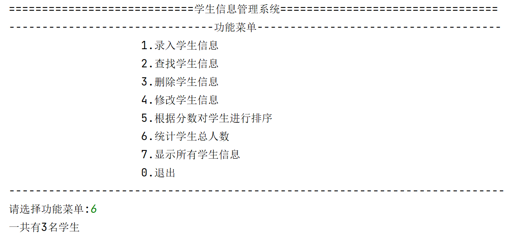

## 案例描述
我们需要开发一个基于控制台的学生管理系统。 该系统需要包括以下7大模块：
- 录入学生信息模块
- 查找学生信息模块
- 删除学生信息模块
- 修改学生信息模块
- 学生成绩排名模块
- 统计学生总人数模块
- 显示全部学生信息模块

模块分类:
- 学生信息维护
>录入学生信息
删除学生信息
修改学生信息

- 查询和统计
>按学生姓名查找
按学生ID查找
查询并显示所有学生信息
统计学生总人数

- 排序
> **升序**
根据数学成绩排序
根据语文成绩排序
根据英语成绩排序
> **降序**
根据数学成绩排序
根据语文成绩排序
根据英语成绩排序

## 知识点提示
- 对数据流的控制语句`while`, `for/in`, `if/else`的使用
- 通过`input`函数来从控制台输入内容，通过`print`函数向控制台输出内容
- 对数据结构`list`,`dict`,`set` 的灵活运用
- 使用`open`函数来操作文件（比如,写入数据和获取数据)
- 通过`os.path`模块判断文件是否存在
- 通过`sort`方法对`list`进行升序或者降序排列

## 源代码（仅供参考)

### 系统运行主界面


主函数的功能菜单

|菜单编号| 功能函数|
| --- | --- |
| 0 | 退出系统|
| 1 | 录入学生信息，调用`insert_student()`函数|
| 2 | 查找学生信息，调用`search_student()`函数|
| 3 | 删除学生信息，调用`delete_student()`函数|
| 4 | 修改学生信息，调用`modify_student()`函数|
| 5 | 根据分数对学生进行排序，调用`sort_students_by_score()`函数|
| 6 | 统计学生总人数，调用`sum_students()`函数|
| 7 | 显示所有学生信息，调用`show_all_students()`函数|

```python
"""系统运行主界面.
"""

YES = ('yes','y')
NO = ('no','n')


def show_menu():
    print('============================学生信息管理系统=================================')
    print('-------------------------------功能菜单-------------------------------------')
    prefix_blank = '                   '
    print(prefix_blank, '1.录入学生信息')
    print(prefix_blank, '2.查找学生信息')
    print(prefix_blank, '3.删除学生信息')
    print(prefix_blank, '4.修改学生信息')
    print(prefix_blank, '5.根据分数对学生进行排序')
    print(prefix_blank, '6.统计学生总人数')
    print(prefix_blank, '7.显示所有学生信息')
    print(prefix_blank, '0.退出')
    print('---------------------------------------------------------------------------')


def insert_student():
    pass


def search_student():
    pass


def delete_student():
    pass


def modify_student():
    pass


def sort_students_by_score():
    pass


def sum_students():
    pass


def show_all_students():
    pass


def main():
    while True:
        show_menu()
        menu_choice = int(input('请选择功能菜单:'))
        if menu_choice in [0, 1, 2, 3, 4, 5, 6, 7]:
            if menu_choice == 0:
                quit_answer = input('你确定退出系统吗? y/n:').lower()
                if quit_answer in YES:
                    print('感谢您的使用!!')
                    # 退出系统
                    break
                else:
                    # 继续使用系统
                    continue
            elif menu_choice == 1:
                # 录入学生信息
                insert_student()
            elif menu_choice == 2:
                # 查找学生信息
                search_student()
            elif menu_choice == 3:
                # 删除学生信息
                delete_student()
            elif menu_choice == 4:
                # 修改学生信息
                modify_student()
            elif menu_choice == 5:
                # 根据分数来对学生进行排序
                sort_students_by_score()
            elif menu_choice == 6:
                # 统计学生总人数
                sum_students()
            elif menu_choice == 7:
                # 显示所有学生信息
                show_all_students()


if __name__ == '__main__':
    main()
```
运行效果：


### 录入学生信息模块


```python
# 学生信息字段
STUDENT_ID = 'id'
STUDENT_NAME = 'name'
STUDENT_SCORE_CHINESE = 'chinese'
STUDENT_SCORE_MATH = 'math'
STUDENT_SCORE_ENGLISH = 'english'
# 成绩最多保持2位小数
SCORE_PRECISION = 2
STUDENT_TXT_FILE = 'students.txt'

UTF_8 = 'UTF-8'

def save_students_to_file(student_lst):
    # 如果students.txt文件已经存在，采用追加的方式写入新数据, 如果不存在，使用写入方式录入新数据
    if os.path.exists(STUDENT_TXT_FILE):
        student_txt_file = open(STUDENT_TXT_FILE, mode='a', encoding=UTF_8)
    else:
        student_txt_file = open(STUDENT_TXT_FILE, mode='w', encoding=UTF_8)

    # 写入新的学生学生信息
    for student in student_lst:
        student_txt_file.write(str(student)+'\n')
    # 关闭文件释放内存
    student_txt_file.close()


def insert_student():
    student_lst = []
    while True:
        stu_id = input('请输入ID(如1001):')
        if not stu_id:
            print('学生ID不能为空，请重新输入!!!')
            continue
        stu_name = input('请输入姓名:')
        if not stu_name:
            print('学生名字不能为空，请重新输入!!!')
            continue
        try:
            chinese_score = round(float(input('请输入语文成绩:')), SCORE_PRECISION)
            math_score = round(float(input('请输入数学成绩:')), SCORE_PRECISION)
            english_score = round(float(input('请输入英语成绩:')), SCORE_PRECISION)
        except:
            print('输入成绩不是浮点数类型，请重新输入！！！')
            continue

        # 使用字典来保存学生数据
        student_info = {
            STUDENT_ID: stu_id,
            STUDENT_NAME: stu_name,
            STUDENT_SCORE_CHINESE: chinese_score,
            STUDENT_SCORE_MATH: math_score,
            STUDENT_SCORE_ENGLISH: english_score
        }

        # 添加到学生列表中
        student_lst.append(student_info)

        add_more_answer = input('是否继续添加? y/n:')
        if add_more_answer in YES:
            continue
        else:
            break

    # 把学生信息保存到文本文件
    if student_lst:
        save_students_to_file(student_lst)
        print('学生信息录入完毕!!!')

```
运行效果：


### 删除学生信息模块


```python
def delete_student():
    while True:
        stu_id = input('请输入要删除的学生ID:')
        if stu_id:
            if os.path.exists(STUDENT_TXT_FILE):
                # 使用只读模式打开students.txt
                with open(STUDENT_TXT_FILE, mode='r', encoding=UTF_8) as f:
                    students_old = f.readlines()
            else:
                students_old = []

            del_flg = False  # 是否删除标记
            if students_old:
                with open(STUDENT_TXT_FILE, mode='w', encoding=UTF_8) as f:
                    for item in students_old:
                        student_old = dict(eval(item))
                        if student_old[STUDENT_ID] != stu_id:
                            f.write(str(student_old) + '\n')
                        else:
                            del_flg = True
                    if del_flg:
                        print(f'已经删除ID为{stu_id}学生数据')
                    else:
                        print(f'没有找到ID为{stu_id}的数据')
            else:
                print('无学生信息!!!')
                break

        # 删除之后，重新显示所有学生信息
        show_all_students()

        # 是否继续删除学生信息
        del_more_answer = input('是否继续删除学生信息? y/n:')
        if del_more_answer in YES:
            continue
        else:
            break


```
运行效果：


### 修改学生信息模块


```python
def modify_student():
    # 显示所有学生信息
    show_all_students()

    if os.path.exists(STUDENT_TXT_FILE):
        # 使用只读模式打开students.txt
        with open(STUDENT_TXT_FILE, mode='r', encoding=UTF_8) as f:
            students_old = f.readlines()
    else:
        print('无学生信息！！！')
        return

    stu_id = input('请输入要修改的学生ID:')
    with open(STUDENT_TXT_FILE, mode='w', encoding=UTF_8) as f:
        for item in students_old:
            student_old = dict(eval(item))
            if student_old[STUDENT_ID] == stu_id:
                print('找到学生信息，可以修改他的其他信息了!')
                while True:
                    stu_name = input('请输入姓名(如果为空,将保持旧名字):')
                    if stu_name:
                        student_old[STUDENT_NAME] = stu_name
                    try:
                        chinese_score = input('请输入语文成绩(如果为空,将保持旧成绩):')
                        if chinese_score:
                            student_old[STUDENT_SCORE_CHINESE] = float(chinese_score)

                        math_score = input('请输入数学成绩(如果为空,将保持旧成绩):')
                        if math_score:
                            student_old[STUDENT_SCORE_MATH] = float(math_score)

                        english_score = input('请输入英语成绩(如果为空,将保持旧成绩):')
                        if english_score:
                            student_old[STUDENT_SCORE_ENGLISH] = float(english_score)
                    except:
                        print('输入成绩不是浮点数类型，请重新输入!!!')
                        continue

                    f.write(str(student_old)+'\n')
                    print('修改成功!!!')
                    break
            else:
                f.write(str(student_old)+'\n')

    modify_more_answer = input('是否继续修改其他学生信息? y/n:')
    if modify_more_answer in YES:
        modify_student()
    else:
        return
```
运行效果:


### 查找学生信息模块


```python
def show_students(student_lst):
    if student_lst:
        # 居中对齐
        title_fmt = '{:^6}\t{:^12}\t{:^8}\t{:^8}\t{:^8}\t{:^8}'
        data_fmt = '{:^6}\t{:^12}\t{:^10}\t{:^10}\t{:^10}\t{:^10}'
        # 定义标题
        print(title_fmt.format('ID', '姓名', '语文成绩', '数学成绩', '英语成绩', '总成绩'))
        for student in student_lst:
            sum_score = float(student[STUDENT_SCORE_CHINESE]) \
                        + float(student[STUDENT_SCORE_MATH]) \
                        + float(student[STUDENT_SCORE_ENGLISH])
            sum_score = round(sum_score, SCORE_PRECISION)
            print(data_fmt.format(student[STUDENT_ID],
                                 student[STUDENT_NAME],
                                 student[STUDENT_SCORE_CHINESE],
                                 student[STUDENT_SCORE_MATH],
                                 student[STUDENT_SCORE_ENGLISH],
                                 sum_score))
    else:
        print('没有查询到学生信息，无数据可显示!!!')
        return


def search_student():
    while True:
        stu_id = ''
        stu_name = ''
        if os.path.exists(STUDENT_TXT_FILE):
            student_query = []
            mode = input('按ID查找输入1, 按姓名查找输入2:')
            if mode == '1':
                stu_id = input('请输入ID:')
            elif mode == '2':
                stu_name = input('请输入名字:')
            else:
                print('你的输入有误, 请重新输入!!!')
                continue
            # 使用只读模式打开students.txt
            with open(STUDENT_TXT_FILE, mode='r', encoding=UTF_8) as f:
                students_old = f.readlines()
                for item in students_old:
                    student_old = dict(eval(item))
                    # 按照ID进行查找
                    if stu_id:
                        if student_old[STUDENT_ID] == stu_id:
                            student_query.append(student_old)
                    # 按照姓名查找
                    elif stu_name:
                        if student_old[STUDENT_NAME] == stu_name:
                            student_query.append(student_old)

            # 显示学生信息
            show_students(student_query)

            # 清空查询结果
            student_query.clear()

            search_more_answer = input('是否继续查询学生信息? y/n:')
            if search_more_answer in YES:
                continue  # 继续查询
            else:
                break  # 退出查询
        else:
            print('无学生信息!!!')
            return

```
运行效果：


### 显示所有学生信息模块


```python
def show_all_students():
    if os.path.exists(STUDENT_TXT_FILE):
        student_lst = []
        # 使用只读模式打开students.txt
        with open(STUDENT_TXT_FILE, mode='r', encoding=UTF_8) as f:
            students = f.readlines()
            for item in students:
                student = dict(eval(item))
                student_lst.append(student)
            if student_lst:
                show_students(student_lst)
    else:
        print('无学生信息!!!')
        return
```
运行效果:


### 统计学生总人数模块


```python
def sum_students():
    if os.path.exists(STUDENT_TXT_FILE):
        student_lst = []
        # 使用只读模式打开students.txt
        with open(STUDENT_TXT_FILE, mode='r', encoding=UTF_8) as f:
            students = f.readlines()
            if students:
                print(f'一共有{len(students)}名学生')
            else:
                print('当前还没有录入任何学生信息!!!')
    else:
        print('无学生信息!!!')
        return
```
运行效果:




### 根据分数对学生进行排序模块


```python
def sort_students_by_score():
    if os.path.exists(STUDENT_TXT_FILE):
        student_lst = []
        # 使用只读模式打开students.txt
        with open(STUDENT_TXT_FILE, mode='r', encoding=UTF_8) as f:
            students = f.readlines()
            for item in students:
                student = dict(eval(item))

                student_lst.append(student)

            if student_lst:
                while True:
                    reverse_flg = False
                    asc_or_desc = input('请选择(0-升序, 1-降序, -1-退出排序):')
                    if asc_or_desc == '0':
                        reverse_flg = False
                    elif asc_or_desc == '1':
                        reverse_flg = True
                    elif asc_or_desc == '-1':
                        print('退出排序')
                        return
                    else:
                        print('你的输入有误, 请重新输入!!!')
                        continue

                    mode = input('请选择排序方式(1-按英语成绩排序, 2-按语文成绩排序, 3-按数学成绩排序, 0-按总成绩排序, -1-退出排序):')
                    if mode == '1':
                        student_lst.sort(key=lambda x: float(x[STUDENT_SCORE_ENGLISH]), reverse=reverse_flg)
                    elif mode == '2':
                        student_lst.sort(key=lambda x: float(x[STUDENT_SCORE_CHINESE]), reverse=reverse_flg)
                    elif mode == '3':
                        student_lst.sort(key=lambda x: float(x[STUDENT_SCORE_MATH]), reverse=reverse_flg)
                    elif mode == '0':
                        student_lst.sort(key=lambda x: round(float(x[STUDENT_SCORE_MATH]) +
                                                             float(x[STUDENT_SCORE_CHINESE]) +
                                                             float(x[STUDENT_SCORE_ENGLISH]), SCORE_PRECISION),
                                         reverse=reverse_flg)
                    elif mode == '-1':
                        print('退出排序')
                        return
                    else:
                        print('你的输入有误, 请重新输入!!!')
                        continue

                    break

                show_students(student_lst)
            else:
                print('当前还没有录入任何学生信息!!!')

    else:
        print('无学生信息!!!')
        return
```
运行效果:


### 应用程序完整代码
`student_system.py`：
```python
"""系统运行主界面.
"""
import os

# Yes or No 应答选择
YES = ('yes', 'y')
NO = ('no', 'n')

# 学生信息字段
STUDENT_ID = 'id'
STUDENT_NAME = 'name'
STUDENT_SCORE_CHINESE = 'chinese'
STUDENT_SCORE_MATH = 'math'
STUDENT_SCORE_ENGLISH = 'english'

# 成绩最多保持2位小数
SCORE_PRECISION = 2

STUDENT_TXT_FILE = 'students.txt'

UTF_8 = 'UTF-8'


def show_menu():
    print('============================学生信息管理系统=================================')
    print('-------------------------------功能菜单-------------------------------------')
    prefix_blank = '                   '
    print(prefix_blank, '1.录入学生信息')
    print(prefix_blank, '2.查找学生信息')
    print(prefix_blank, '3.删除学生信息')
    print(prefix_blank, '4.修改学生信息')
    print(prefix_blank, '5.根据分数对学生进行排序')
    print(prefix_blank, '6.统计学生总人数')
    print(prefix_blank, '7.显示所有学生信息')
    print(prefix_blank, '0.退出')
    print('---------------------------------------------------------------------------')


def save_students_to_file(student_lst):
    # 如果students.txt文件已经存在，采用追加的方式写入新数据, 如果不存在，使用写入方式录入新数据
    if os.path.exists(STUDENT_TXT_FILE):
        student_txt_file = open(STUDENT_TXT_FILE, mode='a', encoding=UTF_8)
    else:
        student_txt_file = open(STUDENT_TXT_FILE, mode='w', encoding=UTF_8)

    # 写入新的学生学生信息
    for student in student_lst:
        student_txt_file.write(str(student) + '\n')
    # 关闭文件释放内存
    student_txt_file.close()


def insert_student():
    student_lst = []
    while True:
        stu_id = input('请输入ID(如1001):')
        if not stu_id:
            print('学生ID不能为空，请重新输入!!!')
            continue
        stu_name = input('请输入姓名:')
        if not stu_name:
            print('学生名字不能为空，请重新输入!!!')
            continue
        try:
            chinese_score = round(float(input('请输入语文成绩:')), SCORE_PRECISION)
            math_score = round(float(input('请输入数学成绩:')), SCORE_PRECISION)
            english_score = round(float(input('请输入英语成绩:')), SCORE_PRECISION)
        except:
            print('输入成绩不是浮点数类型，请重新输入!!!')
            continue

        # 使用字典来保存学生数据
        student_info = {
            STUDENT_ID: stu_id,
            STUDENT_NAME: stu_name,
            STUDENT_SCORE_CHINESE: chinese_score,
            STUDENT_SCORE_MATH: math_score,
            STUDENT_SCORE_ENGLISH: english_score
        }

        # 添加到学生列表中
        student_lst.append(student_info)

        add_more_answer = input('是否继续添加? y/n:')
        if add_more_answer in YES:
            continue
        else:
            break

    # 把学生信息保存到文本文件
    if student_lst:
        save_students_to_file(student_lst)
        print('学生信息录入完毕!!!')


def show_students(student_lst):
    if student_lst:
        # 居中对齐
        title_fmt = '{:^6}\t{:^12}\t{:^8}\t{:^8}\t{:^8}\t{:^8}'
        data_fmt = '{:^6}\t{:^12}\t{:^10}\t{:^10}\t{:^10}\t{:^10}'
        # 定义标题
        print(title_fmt.format('ID', '姓名', '语文成绩', '数学成绩', '英语成绩', '总成绩'))
        for student in student_lst:
            sum_score = float(student[STUDENT_SCORE_CHINESE]) \
                        + float(student[STUDENT_SCORE_MATH]) \
                        + float(student[STUDENT_SCORE_ENGLISH])
            sum_score = round(sum_score, SCORE_PRECISION)
            print(data_fmt.format(student[STUDENT_ID],
                                  student[STUDENT_NAME],
                                  student[STUDENT_SCORE_CHINESE],
                                  student[STUDENT_SCORE_MATH],
                                  student[STUDENT_SCORE_ENGLISH],
                                  sum_score))
    else:
        print('没有查询到学生信息，无数据可显示!!!')
        return


def search_student():
    while True:
        stu_id = ''
        stu_name = ''
        if os.path.exists(STUDENT_TXT_FILE):
            student_query = []
            mode = input('按ID查找输入1, 按姓名查找输入2:')
            if mode == '1':
                stu_id = input('请输入ID:')
            elif mode == '2':
                stu_name = input('请输入名字:')
            else:
                print('你的输入有误, 请重新输入!!!')
                continue
            # 使用只读模式打开students.txt
            with open(STUDENT_TXT_FILE, mode='r', encoding=UTF_8) as f:
                students_old = f.readlines()
                for item in students_old:
                    student_old = dict(eval(item))
                    # 按照ID进行查找
                    if stu_id:
                        if student_old[STUDENT_ID] == stu_id:
                            student_query.append(student_old)
                    # 按照姓名查找
                    elif stu_name:
                        if student_old[STUDENT_NAME] == stu_name:
                            student_query.append(student_old)

            # 显示学生信息
            show_students(student_query)

            # 清空查询结果
            student_query.clear()

            search_more_answer = input('是否继续查询学生信息? y/n:')
            if search_more_answer in YES:
                continue  # 继续查询
            else:
                break  # 退出查询
        else:
            print('无学生信息!!!')
            return


def delete_student():
    while True:
        stu_id = input('请输入要删除的学生ID:')
        if stu_id:
            if os.path.exists(STUDENT_TXT_FILE):
                # 使用只读模式打开students.txt
                with open(STUDENT_TXT_FILE, mode='r', encoding=UTF_8) as f:
                    students_old = f.readlines()
            else:
                students_old = []

            del_flg = False  # 是否删除标记
            if students_old:
                with open(STUDENT_TXT_FILE, mode='w', encoding=UTF_8) as f:
                    for item in students_old:
                        student_old = dict(eval(item))
                        if student_old[STUDENT_ID] != stu_id:
                            f.write(str(student_old) + '\n')
                        else:
                            del_flg = True
                    if del_flg:
                        print(f'已经删除ID为{stu_id}学生数据!!!')
                    else:
                        print(f'没有找到ID为{stu_id}的数据!!!')
            else:
                print('无学生信息!!!')
                break

        # 删除之后，重新显示所有学生信息
        show_all_students()

        # 是否继续删除学生信息
        del_more_answer = input('是否继续删除学生信息? y/n:')
        if del_more_answer in YES:
            continue
        else:
            break


def modify_student():
    # 显示所有学生信息
    show_all_students()

    if os.path.exists(STUDENT_TXT_FILE):
        # 使用只读模式打开students.txt
        with open(STUDENT_TXT_FILE, mode='r', encoding=UTF_8) as f:
            students_old = f.readlines()
    else:
        print('无学生信息！！！')
        return

    stu_id = input('请输入要修改的学生ID:')
    with open(STUDENT_TXT_FILE, mode='w', encoding=UTF_8) as f:
        for item in students_old:
            student_old = dict(eval(item))
            if student_old[STUDENT_ID] == stu_id:
                print('找到学生信息，可以修改他的其他信息了!')
                while True:
                    stu_name = input('请输入姓名(如果为空,将保持旧名字):')
                    if stu_name:
                        student_old[STUDENT_NAME] = stu_name
                    try:
                        chinese_score = input('请输入语文成绩(如果为空,将保持旧成绩):')
                        if chinese_score:
                            student_old[STUDENT_SCORE_CHINESE] = float(chinese_score)

                        math_score = input('请输入数学成绩(如果为空,将保持旧成绩):')
                        if math_score:
                            student_old[STUDENT_SCORE_MATH] = float(math_score)

                        english_score = input('请输入英语成绩(如果为空,将保持旧成绩):')
                        if english_score:
                            student_old[STUDENT_SCORE_ENGLISH] = float(english_score)
                    except:
                        print('输入成绩不是浮点数类型，请重新输入!!!')
                        continue

                    f.write(str(student_old) + '\n')
                    print('修改成功!!!')
                    break
            else:
                f.write(str(student_old) + '\n')

    modify_more_answer = input('是否继续修改其他学生信息? y/n:')
    if modify_more_answer in YES:
        modify_student()
    else:
        return


def sort_students_by_score():
    if os.path.exists(STUDENT_TXT_FILE):
        student_lst = []
        # 使用只读模式打开students.txt
        with open(STUDENT_TXT_FILE, mode='r', encoding=UTF_8) as f:
            students = f.readlines()
            for item in students:
                student = dict(eval(item))

                student_lst.append(student)
            if student_lst:
                while True:
                    reverse_flg = False
                    asc_or_desc = input('请选择(0-升序, 1-降序, -1-退出排序):')
                    if asc_or_desc == '0':
                        reverse_flg = False
                    elif asc_or_desc == '1':
                        reverse_flg = True
                    elif asc_or_desc == '-1':
                        print('退出排序')
                        return
                    else:
                        print('你的输入有误, 请重新输入!!!')
                        continue

                    mode = input('请选择排序方式(1-按英语成绩排序, 2-按语文成绩排序, 3-按数学成绩排序, 0-按总成绩排序, -1-退出排序):')
                    # list.sort方法默认是按照升序，我们通过reverse标志位来控制是否按照降序
                    if mode == '1':
                        student_lst.sort(key=lambda x: float(x[STUDENT_SCORE_ENGLISH]), reverse=reverse_flg)
                    elif mode == '2':
                        student_lst.sort(key=lambda x: float(x[STUDENT_SCORE_CHINESE]), reverse=reverse_flg)
                    elif mode == '3':
                        student_lst.sort(key=lambda x: float(x[STUDENT_SCORE_MATH]), reverse=reverse_flg)
                    elif mode == '0':
                        student_lst.sort(key=lambda x: round(float(x[STUDENT_SCORE_MATH]) +
                                                             float(x[STUDENT_SCORE_CHINESE]) +
                                                             float(x[STUDENT_SCORE_ENGLISH]), SCORE_PRECISION),
                                         reverse=reverse_flg)
                    elif mode == '-1':
                        print('退出排序')
                        return
                    else:
                        print('你的输入有误, 请重新输入!!!')
                        continue

                    break

                show_students(student_lst)
            else:
                print('当前还没有录入任何学生信息!!!')

    else:
        print('无学生信息!!!')
        return


def sum_students():
    if os.path.exists(STUDENT_TXT_FILE):
        # 使用只读模式打开students.txt
        with open(STUDENT_TXT_FILE, mode='r', encoding=UTF_8) as f:
            students = f.readlines()
            if students:
                print(f'一共有{len(students)}名学生')
            else:
                print('当前还没有录入任何学生信息!!!')
    else:
        print('无学生信息!!!')
        return


def show_all_students():
    if os.path.exists(STUDENT_TXT_FILE):
        student_lst = []
        # 使用只读模式打开students.txt
        with open(STUDENT_TXT_FILE, mode='r', encoding=UTF_8) as f:
            students = f.readlines()
            for item in students:
                student = dict(eval(item))
                student_lst.append(student)
            if student_lst:
                show_students(student_lst)
    else:
        print('无学生信息!!!')
        return


def main():
    while True:
        show_menu()
        menu_choice = int(input('请选择功能菜单:'))
        if menu_choice in [0, 1, 2, 3, 4, 5, 6, 7]:
            if menu_choice == 0:
                quit_answer = input('你确定退出系统吗? y/n:').lower()
                if quit_answer in YES:
                    print('感谢您的使用!!')
                    # 退出系统
                    break
                else:
                    # 继续使用系统
                    continue
            elif menu_choice == 1:
                # 录入学生信息
                insert_student()
            elif menu_choice == 2:
                # 查找学生信息
                search_student()
            elif menu_choice == 3:
                # 删除学生信息
                delete_student()
            elif menu_choice == 4:
                # 修改学生信息
                modify_student()
            elif menu_choice == 5:
                # 根据分数来对学生进行排序
                sort_students_by_score()
            elif menu_choice == 6:
                # 统计学生总人数
                sum_students()
            elif menu_choice == 7:
                # 显示所有学生信息
                show_all_students()


if __name__ == '__main__':
    main()
```
## 项目打包成可执行文件
- 配置好`python3`本地环境
- 通过命令窗口安装`pyinstaller`
```commandline
> python -m pip install pyinstaller
```


- 使用`pyinstaller`生成可执行文件
```commandline
pyinstaller -F D:\laolang_development\github\laolang_tutorials\learn_python3\青少年编程案例\学生信息管理系统\student_system.py
```


注意：这里你需要修改为你的`.py`文件所在的路径。

可执行文件(windows下以`.exe`为扩展名), 将会存放在`dist`目录下：


你可以双击`exe`文件运行应用程序，并进行相关操作：


## 参考资料
[Python入门案例——学生信息管理系统](https://www.bilibili.com/video/BV1xV4y1s773?p=1)