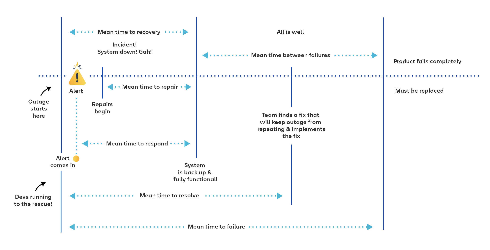

# MTBF, MTTR, MTTA, and MTTF

Understanding a few of the most common incident metrics

In today’s always-on world, outages and technical incidents matter more than ever before. Glitches and downtime come with real consequences. Missed deadlines. Late payments. Project delays.

Which is why it’s important for companies to [quantify and track metrics](https://www.atlassian.com/incident-management/kpis) around uptime, downtime, and how quickly and effectively teams are resolving issues.

Some of the industry’s most commonly tracked metrics are MTBF (mean time before failure), MTTR (mean time to recovery, repair, respond, or resolve), MTTF (mean time to failure), and MTTA (mean time to acknowledge)—a series of metrics designed to help tech teams understand how often incidents occur and how quickly the team bounces back from those incidents.

A lot of experts [argue](https://www.adaptivecapacitylabs.com/blog/2018/03/23/moving-past-shallow-incident-data/) that these metrics aren’t actually that useful on their own because they don’t ask the messier questions of how incidents are resolved, what works and what doesn’t, and how, when, and why issues escalate or deescalate.

On the other hand, MTTR, MTBF, and MTTF can be a good baseline or benchmark that starts conversations that lead into those deeper, important questions.

## A disclaimer about MTTR

When we talk about MTTR, it’s easy to assume it’s a single metric with a single meaning. But the truth is it potentially represents **four different measurements**. The R can stand for repair, recovery, respond, or resolve, and while the four metrics do overlap, **they each have their own meaning and nuance.**

So if your team is talking about tracking MTTR, it’s a good idea to clarify which MTTR they mean and how they’re defining it. Before you start tracking successes and failures, your team needs to be on the same page about exactly what you’re tracking and be sure everyone knows they’re talking about the same thing.

## MTBF: Mean time between failures

### What is mean time between failures?

**MTBF (mean time between failures) is the average time between repairable failures of a technology product.** The metric is used to track both the availability and reliability of a product. The higher the time between failure, the more reliable the system.

The goal for most companies to keep MTBF as high as possible—putting hundreds of thousands of hours (or even millions) between issues.

### How to calculate mean time between failures

MTBF is calculated using an arithmetic mean. Basically, this means taking the data from the period you want to calculate (perhaps six months, perhaps a year, perhaps five years) and dividing that period’s total operational time by the number of failures.

So, let’s say we’re assessing a 24-hour period and there were two hours of downtime in two separate incidents. Our total uptime is 22 hours. Divided by two, that’s 11 hours. So our MTBF is 11 hours.

Because the metric is used to track reliability, MTBF does not factor in expected down time during scheduled maintenance. Instead, it focuses on unexpected outages and issues.

### The origins of mean time between failures

MTBF comes to us from the aviation industry, where system failures mean particularly major consequences not only in terms of cost, but human life as well. The initialism has since made its way across a variety of technical and mechanical industries and is used particularly often in manufacturing.

### How and when to use mean time between failures

MTBF is helpful for buyers who want to make sure they get the most reliable product, fly the most reliable airplane, or choose the safest manufacturing equipment for their plant.

For internal teams, it’s a metric that helps identify issues and track successes and failures. It can also help companies develop informed recommendations about when customers should replace a part, upgrade a system, or bring a product in for maintenance.

MTBF is a metric for failures in **repairable systems**. For failures that require system replacement, typically people use the term MTTF (mean time to failure).

For example, think of a car engine. When calculating the time between unscheduled engine maintenance, you’d use MTBF—mean time between failures. When calculating the time between replacing the full engine, you’d use MTTF (mean time to failure).

## MTTR: Mean time to repair

### What is mean time to repair?

**MTTR (mean time to repair) is the average time it takes to repair a system (usually technical or mechanical)**. It includes both the repair time and any testing time. The clock doesn’t stop on this metric until the system is fully functional again.

### How to calculate mean time to repair

You can calculate MTTR by adding up the total time spent on repairs during any given period and then dividing that time by the number of repairs.

So, let’s say we’re looking at repairs over the course of a week. In that time, there were 10 outages and systems were actively being repaired for four hours. Four hours is 240 minutes. 240 divided by 10 is 24. Which means the mean time to repair in this case would be 24 minutes.

### The limitations of mean time to repair

Mean time to repair is not always the same amount of time as the system outage itself. In some cases, repairs start within minutes of a product failure or system outage. In other cases, there’s a lag time between the issue, when the issue is detected, and when the repairs begin.

This metric is most useful when tracking how quickly maintenance staff is able to repair an issue. It’s not meant to identify problems with your system alerts or pre-repair delays—both of which are also important factors when assessing the successes and failures of your incident management programs.

### How and when to use mean time to repair

MTTR is a metric support and maintenance teams use to keep repairs on track. The goal is to get this number as low as possible by increasing the efficiency of repair processes and teams. 

## MTTR: Mean time to recovery

### What is mean time to recovery?

**MTTR (mean time to recovery or mean time to restore) is the average time it takes to recover from a product or system failure.** This includes the full time of the outage—from the time the system or product fails to the time that it becomes fully operational again.

It's a key [DevOps metric](https://www.atlassian.com/devops/frameworks/devops-metrics) that can be used to measure the stability of a DevOps team, as noted by DevOps Research and Assessment (DORA).

### How to calculate mean time to recovery

Mean time to recovery is calculated by adding up all the downtime in a specific period and dividing it by the number of incidents. So, let’s say our systems were down for 30 minutes in two separate incidents in a 24-hour period. 30 divided by two is 15, so our MTTR is 15 minutes.

### The limitations of mean time to recovery

This MTTR is a measure of the speed of your full recovery process. Is it as quick as you want it to be? How does it compare to your competitors?

This is a high-level metric that helps you identify if you have a problem. However, if you want to diagnose ***where\* the problem lies within your process** (is it an issue with your alerts system? Is the team taking too long on fixes? Does it take too long for someone to respond to a fix request?), **you’ll need more data**. Because there’s more than one thing happening between failure and recovery.

The problem could be with your alert system. Is there a delay between a failure and an alert? Are alerts taking longer than they should to get to the right person?

The problem could be with diagnostics. Are you able to figure out what the problem is quickly? Are there processes that could be improved?

Or the problem could be with repairs. Are your maintenance teams as effective as they could be? If they’re taking the bulk of the time, what’s tripping them up?

You’ll need to look deeper than MTTR to answer those questions, but mean time to recovery can provide a starting point for diagnosing whether there’s a problem with your recovery process that requires you to dig deeper.

### How and when to use mean time to recovery

MTTR is a good metric for assessing the speed of your overall recovery process.

## MTTR: Mean time to resolve

### What is mean time to resolve?

**MTTR (mean time to resolve) is the average time it takes to fully resolve a failure**. This includes not only the time spent detecting the failure, diagnosing the problem, and repairing the issue, but also t**he time spent ensuring that the failure won’t happen again.**

This metric extends the responsibility of the team handling the fix to improving performance long-term. It’s the difference between putting out a fire and putting out a fire and then fireproofing your house. 

There is a strong correlation between this MTTR and customer satisfaction, so it’s something to sit up and pay attention to.

### How to calculate mean time to resolve

To calculate this MTTR, add up the full resolution time during the period you want to track and divide by the number of incidents.

So, if your systems were down for a total of two hours in a 24-hour period in a single incident and teams spent an additional two hours putting fixes in place to ensure the system outage doesn’t happen again, that’s four hours total spent resolving the issue. Which means your MTTR is four hours.

### A note about tracking mean time to resolve

Keep in mind that MTTR is most frequently calculated using business hours (so, if you recover from an issue at closing time one day and spend time fixing the underlying issue first thing the next morning, your MTTR wouldn’t include the 16 hours you spent away from the office). If you have teams in multiple locations working around the clock or if you have on-call employees working after hours, it’s important to define how you will track time for this metric.

### How and when to use mean time to resolve

MTTR is typically used when talking about unplanned incidents, not service requests (which are typically planned).

## MTTR: Mean time to respond

### What is mean time to respond?

**MTTR (mean time to respond) is the average time it takes to recover from a product or system failure from the time when you are first alerted to that failure.** This does not include any lag time in your alert system.

### How to calculate mean time to respond

To calculate this MTTR, add up the full response time from alert to when the product or service is fully functional again. Then divide by the number of incidents.

For example: If you had four incidents in a 40-hour workweek and spent one total hour on them (from alert to fix), your MTTR for that week would be 15 minutes. 

### How and when to use mean time to respond

This MTTR is often used in cybersecurity when measuring a team’s success in neutralizing system attacks.

## MTTA: Mean time to acknowledge

### What is mean time between to acknowledge?

**MTTA (mean time to acknowledge) is the average time it takes from when an alert is triggered to when work begins on the issue.** This metric is useful for tracking your team’s responsiveness and your alert system’s effectiveness. 

### How to calculate mean time to acknowledge

To calculate your MTTA, add up the time between alert and acknowledgement, then divide by the number of incidents. 

For example: If you had 10 incidents and there was a total of 40 minutes of time between alert and acknowledgement for all 10, you divide 40 by 10 and come up with an average of four minutes.

### How and when to use mean time to acknowledge

MTTA is useful in tracking responsiveness. Is your team suffering from alert fatigue and taking too long to respond? This metric will help you flag the issue.

## MTTF: Mean time to failure

### What is mean time to failure?

**MTTF (mean time to failure) is the average time between non-repairable failures of a technology product.** For example, if Brand X’s car engines average 500,000 hours before they fail completely and have to be replaced, 500,000 would be the engines’ MTTF.

The calculation is used to understand how long a system will typically last, determine whether a new version of a system is outperforming the old, and give customers information about expected lifetimes and when to schedule check-ups on their system.

### How to calculate mean time to failure

Mean time to failure is an arithmetic average, so you calculate it by adding up the total operating time of the products you’re assessing and dividing that total by the number of devices.

For example: Let’s say you’re figuring out the MTTF of light bulbs. How long do Brand Y’s light bulbs last on average before they burn out? Let’s further say you have a sample of four light bulbs to test (if you want statistically significant data, you’ll need much more than that, but for the purposes of simple math, let’s keep this small).

Light bulb A lasts 20 hours. Light bulb B lasts 18. Bulb C lasts 21. And bulb D lasts 21 hours. That’s a total of 80 bulb hours. Divided by four, the MTTF is 20 hours.

### The problem of mean time to failure

With an example like light bulbs, MTTF is a metric that makes a lot of sense. We can run the light bulbs until the last one fails and use that information to draw conclusions about the resiliency of our light bulbs.

But what happens when we’re measuring things that don’t fail quite as quickly? Things meant to last years and years? For those cases, though MTTF is often used, it’s not as good of a metric. Because instead of running a product until it fails, most of the time we’re running a product for a defined length of time and measuring how many fail.

For example: Let’s say we’re trying to get MTTF stats on Brand Z’s tablets. Tablets, hopefully, are meant to last for many years. But Brand Z might only have six months to gather data. And so they test 100 tablets for six months. Let’s say one tablet fails exactly at the six-month mark.

So, we multiply the total operating time (six months multiplied by 100 tablets) and come up with 600 months. Only one tablet failed, so we’d divide that by one and our MTTR would be 600 months, which is 50 years.

Are Brand Z’s tablets going to last an average of 50 years each? It’s pretty unlikely. And so the metric breaks down in cases like these.

### How and when to use mean time to failure

MTTF works well when you’re trying to assess the average lifetime of products and systems with a short lifespan (such as light bulbs). It’s also only meant for cases when you’re assessing full product failure. If you’re calculating time in between incidents that require repair, the initialism of choice is MTBF (mean time between failures).

### MTBF vs. MTTR vs. MTTF vs. MTTA

So, which measurement is better when it comes to tracking and improving incident management?

The answer is all of them.

Though they are sometimes used interchangeably, each metric provides a different insight. When used together, they can tell a more complete story about how successful your team is with incident management and where the team can improve.

**Mean time to recovery** tells you how quickly you can get your systems back up and running.

Layer in **mean time to respond** and you get a sense for how much of the recovery time belongs to the team and how much is your alert system.

Further layer in **mean time to repair** and you start to see how much time the team is spending on repairs vs. diagnostics.

Add **mean time to resolve** to the mix and you start to understand the full scope of fixing and resolving issues beyond the actual downtime they cause.

Fold in **mean time between failures** and the picture gets even bigger, showing you how successful your team is at preventing or reducing future issues.

And then add **mean time to failure** to understand the full lifecycle of a product or system.